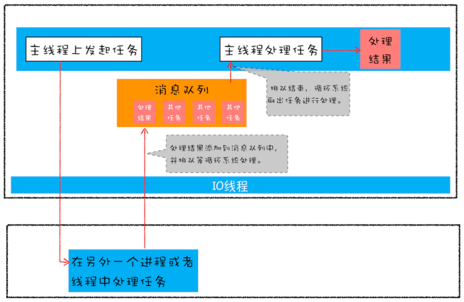

# ES6 新特性

## let 和 const 命令

|                        | var                  | let              | const          |
| ---------------------- | -------------------- | ---------------- | -------------- |
| 作用域                 | 函数级作用域         | 块级作用域       | 块级作用域     |
| 变量提升               | 变量提升 / undefiend | ReferenceError   | ReferenceError |
| 存放位置（执行上下文） | 变量环境             | 词法环境         | 词法环境       |
| 重复声明               | 可以                 | 同作用域下不可以 | 同上           |
| 可变性                 | 可变                 | 同上             | 只读常量       |

- for循环使用 `let` 保证计数器仅在循环体内有效，`var`将计数器 `i`泄露为全局变量

- `let / const`声明的变量不存在变量提升，只能在变量声明后使用，否则报错 `referenceError`

- **暂时性死区**——只要 `let / const`声明变量，声明的变量绑定在该块级区域，不受外部影响

  > 如果区块中存在let和const命令，该区块对 let / const 命令声明的变量，从一开始就形成了封闭作用域。凡是在声明之前就使用这些变量，就会报错

  ```js
  var tmp = 123;
  if (true) {
     tmp = 'abc' // ReferenceError
     let tmp;
  }
  ```

- `const`一旦声明变量，需立即初始化，指向内存地址保存值不可变
  
- 复杂数据类型，内存地址不可变，数据可变
  
- let / const 声明的变量为非全局变量，`window.a //undefined`


### 块级作用域

```js
//IIFE 立即执行函数
（function () {
    var tmp = ...;
    ...
}())

// 块级作用域
{
    let tmp = ...;
    ...
}
```

- ES6 规定，块级作用域之中，函数声明语句的行为类似于let，在块级作用域之外不可引用


## 变量的解构赋值

ES6 允许按照一定模式，**从数组和对象中提取值，对变量进行赋值**

### 数组——解构赋值 

- **解构模式**：数组中提取值，按照对应位置，对变量赋值

  ```js
  let [a, b, c] = [1, 2, 3]
  let [head, ...tail] = [1, 2, 3, 4];
  ```

- 解构不成功，变量的值就等于`undefined`

- 解构赋值指定默认值，默认值生效条件，变量值为 `undefined`

  ```js
  let [foo = true] = [];
  let [x, y = 'b'] = ['a', undefined]; // x='a', y='b'
  ```

### 对象——解构赋值

- **解构模式**：对象的属性没有次序，变量必须与属性同名，才能取到正确的值

  ```js
  let { bar, foo } = { foo: 'aaa', bar: 'bbb' };
  ```

- 解构失败，变量的值等于`undefined`

  ```js
  let { baz } = { foo: 'aaa', bar: 'bbb' };
  baz // undefined
  ```

- 内部机制——前面变量名匹配，后面变量名赋值

  ```js
  let { foo: foo, bar: bar } = { foo: 'aaa', bar: 'bbb' };
  ```

- 对象解构指定默认值，生效条件属性值严格等于 `undefined`

  ```js
  let {x : 3} = {x : undefined}
  ```

  

### 字符串、数值、布尔值——解构赋值

- 字符串转换为一个类似数组的对象

  ```js
  const [a, b, c, d, e] = 'hello'
  let {length : len} = 'hello'
  ```

- **解构赋值规则**——**只要等号右边的值不是对象或数组，就先将其转为对象**

  - 如果等号右边是数值和布尔值，则会先转为对象

    ```js
    let {toString: s} = 123;
    s === Number.prototype.toString // true
    ```

  - `undefined`和`null`无法转为对象，无法解构赋值报错

    ```js
    let { prop: x } = undefined; // TypeError
    ```

  

### 函数参数——解构赋值

```js
// 函数传入数组
function add([x, y]){
  return x + y;
}
add([1, 2]); // 3

[[1, 2], [3, 4]].map(([a, b]) => a + b);  // [ 3, 7 ]

// 函数传入对象
function move({x = 0, y = 0} = {}) {
  return [x, y];
}
move({x: 3, y: 8}); // [3, 8]
move({x: 3}); // [3, 0]
```


### 解构赋值用途

1. 交换变量的值

   ```
   [x, y] = [y, x];
   ```

2. 从函数返回多个值

   ```js
   function example() {
     return [1, 2, 3];
   }
   let [a, b, c] = example();
   ```

3. 函数参数的定义

   ```js
   // 参数是一组有次序的值
   function f([x, y, z]) { ... }
   f([1, 2, 3]);
   
   // 参数是一组无次序的值
   function f({x, y, z}) { ... }
   f({z: 3, y: 2, x: 1});
   ```

4. 提取 JSON 数据

   ```js
   let { id, status, data: number } = jsonData;
   ```

5. 函数参数的默认值

   ```js
   jQuery.ajax = function (url, {
     async = true,
     beforeSend = function () {},
     cache = true,
     complete = function () {},
     crossDomain = false,
     global = true,
     // ... more config
   } = {}) {
     // ... do stuff
   };
   ```

   

## 模板字符串

- 使用反引号（`）标识
- 作用：普通字符串、多行字符串、在字符串中嵌入变量
  - 多行字符串：所有的空格和缩进都会被保留
  - 嵌入变量：将变量名写在`${}`
  
  

## for...of / for...in

- `for ... of`：允许遍历一个含有iterator接口的数据结构并**返回各项值**
  - 遍历数组、Set、Map、类数组结构等

```js
const arr = ['red', 'green', 'blue']

for(let v of arr) {
    console.log(v); //red green blue
}
```


-  `for...in`：允许遍历获得键值
  - for ... in遍历对象的整个原型链,性能较差

```js
var arr = ['a', 'b', 'c', 'd'];

for (let a in arr) {
  console.log(a); // 0 1 2 3
}
```


## 箭头函数

- ES6 允许使用**箭头**（=>）定义函数

- 箭头函数返回对象使用括号

  ```js
  let getTempItem = id => ({ id: id, name: "Temp" });
  ```

- 不存在`arguments`属性保存参数，使用剩余运算符代替

  ```js
  const headAndTail = (head, ...tail) => [head, tail];
  headAndTail(1, 2, 3, 4, 5)  // [1,[2,3,4,5]]
  ```

- 箭头函数不具备this，当前this是词法的，引用的上下文的this
  
  - 由于箭头函数没有`this`，不能使用`call()`、`apply()`、`bind()`改变`this`的指向
- 不可以当作构造函数，使用 `new` 命令——**没有prototype属性**
- 不可以使用`arguments`对象，使用rest参数代替
- 不可以使用 `yield`命令，箭头函数不能用作 Generator 函数


## 剩余/扩展运算符


## 正则表达式

## Symbol的使用场景

### 基本使用

- Symbol 值通过`Symbol`函数生成，且Symbol函数不能使用 `new`命令

- `Symbol`函数前接受字符串，表示对Symbol实例的描述

  - 非字符串调用 `toString`方法
  - 相同参数的 `Symbol`函数返回值不相等

- Symnol值不能与其他类型进行运算，可显式转换为**字符串或布尔值**

- `Symbol.for()`——查找某symbol值，有则返回，无则全局注册

- `Symbol.keyFor()`——返回一个已登记的 Symbol 类型值的`key`

  ```js
  let s1 = Symbol.for("foo");
  Symbol.keyFor(s1) // "foo"
  
  let s2 = Symbol("foo");
  Symbol.keyFor(s2) // undefined
  ```

  

### 消除魔法字符串

——在代码之中多次出现、与代码形成强耦合的某一个具体的字符串或者数值，应使用含义清晰的变量代替

```js
//魔法字符串
const shapeType = {
  triangle: 'Triangle'
};

//symbol
const shapeType = {
  triangle: Symbol()
};

function getArea(shape, options) {
  let area = 0;
  switch (shape) {
    case shapeType.triangle:
      area = .5 * options.width * options.height;
      break;
  }
  return area;
}

getArea(shapeType.triangle, { width: 100, height: 100 });
```

### 阻止对象属性名冲突

——利用 Symbol 值作为属性名防止将对象原有属性名覆盖

```javascript
let obj = {
  [s](arg) { ... }
};
```

### 模拟类的私有方法

——ES6 中的类是没有 private 关键字来声明类的私有方法和私有变量的，可以利用 Symbol 的唯一性来模拟

```js
const speak = Symbol();
class Person {
    [speak]() {
        ...
    }
}
```

- 使用者无法在外部创建出一个相同的 speak，无法调用该方法


## Promise：消灭嵌套调用和多次错误处理

### 异步回调

- 页面主线程发起一个耗时任务，并将任务交给其他进程处理，页面主线程继续执行消息队列的任务
- 其他进程处理耗时任务完成，将该任务添加到渲染进程的消息队列，排队等待循环系统处理
- 排队完成，循环系统取出消息队列的任务进行处理，触发相关回调




### 消灭嵌套调用

- 实现回调函数延时绑定

  - 执行resolve函数时，onResolve回调函数并未绑定，Promise采用**微任务**实现回调函数延时绑定技术
  - 微任务比 `setTimeout(() => {}, 0)`效率更高

  ```js
  //创建Promise实例p1,并在executor函数中执行业务逻辑
  function executor(resolve, reject) {
      //some code
      resolve(100) //回调函数未绑定
  }
  let p1 = new Promise(executor)
  
  // p1延时绑定回调函数 onResolve
  function onResolve(value) {
      console.log(value)
  }
  p1.then(onResolve)
  ```

- 回调函数返回值穿透到最外层

  ```js
  function executor(resolve, reject) {
      //some code
      resolve(100)
  }
  let p1 = new Promise(executor)
  
  function onResolve(value) {
      console.log(value)
    	//调用Promise.resolve() 包装为promise实例  
      return value + 1
  }
  let p2 = p1.then(onResolve)
  p2.then( value => {
      console.log(value)
  })
  ```

  

### 多次错误处理

- Promise 对象的错误**具有“冒泡”性质**，会一直向后传递，直到被 onReject 函数处理或 catch 语句**捕获为止**


###  Promise 中为什么要引入微任务？

**异步操作处理回调的方式**

- 使用同步回调，直到异步任务进行完，再进行后面的任务
- 使用异步回调，将回调函数放在进行`宏任务队列`的队尾
- 使用异步回调，将回调函数放到`当前宏任务中`的最后面

**微任务解决的痛点**

- 采用**异步回调**替代同步回调解决了浪费 CPU 性能的问题
  - 同步回调造成脚本阻塞，当前任务等待，后续任务无法执行，CPU利用率低
- 放到**当前宏任务最后**执行，解决了回调执行的实时性问题
  - 将回调函数放在宏任务队列队尾，若当前任务队列非常长，回调不能及时执行造成页面卡顿


### promise规范

[Promises/A+规范](https://www.ituring.com.cn/article/66566)

- 存在三个状态：等待态(pending)，执行态(fulfilled)，失败态(rejected)
- 初始态为等待态，可以转化为执行态和失败态
- 执行态不可转化为其他状态，且必须有一个不可变的终值(value)
- 失败态不可转化为其他状态，且必须有一个不可变的原因(reason)
- 必须提供一个`then`方法，以供访问其当前值，终值及原因
- then方法提供两个参数：`onFulfilled`和`onRejected`  
- `onFulfilled`和`onRejected`如果不是函数类型，必须忽略
- 如果`executor`执行报错，直接执行`reject`
- 不同的`promise`可以相互套用


### 分布实现Promise

> https://juejin.cn/post/6901513900466896904


