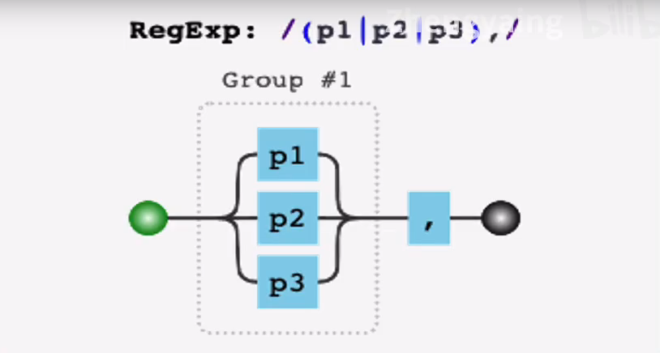
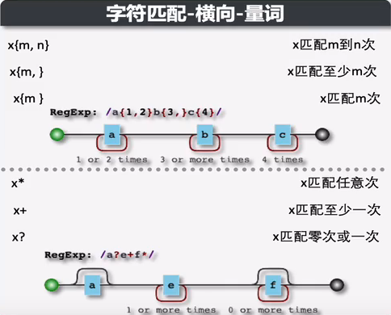
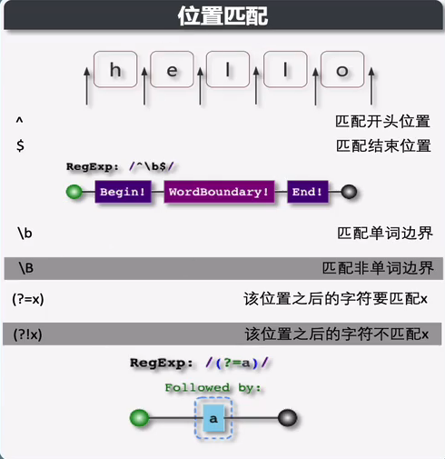

# JavaScript 的常用功能模块


## 正则表达式

> https://juejin.cn/post/6844904119463837704
>
> https://juejin.cn/post/6844904119463837704

### JavaScript中正则表达式

**String.prototype.match()**

- **检索**返回一个字符串匹配正则表达式的结果

  ```js
  'abc&mno&xyz'.match(/[a-z]+/g)
  // ["abc", "mno", "xyz"]
  ```

**String.prototype.replace()**

- **替换**字符串中被正则表达式匹配的值

  ```js
  'abc-xyz-abc'.replace(/abc/g, 'biu')
  //"biu-xyz-biu"
  ```

**String.prototype.search()**

- **搜索**字符串被正则表达式匹配的**位置**，未找到返回-1

  ```js
  'abc-xyz-abc'.search(/xyz/g)
  //4
  ```

**String.prototype.split()**

- 以正则表达式模式**分割**字符串为数组

  ```js
  'abc-def_mno+xyz'.split(/[-_+]/g)
  // ["abc", "def", "mno", "xyz"]
  ```

**RegExp.prototype.exec()**

- 在一个指定字符串中**执行一个搜索匹配**，返回一个结果数组或 null

  ```js
  /abc/.exec('abc-xyz-abc')
  // ["abc", index: 0, input: "abc-xyz-abc", groups: undefined]
  ```

**RegExp.prototype.test()**

- 执行一个检索，查看正则表达式与指定的字符串是否匹配，返回 true 或 false

  ```js
  /abc/.test('abc-xyz-abc')
  //true
  ```


### 匹配模式-字符匹配（纵向）

| 元字符              |                                                     |
| ------------------- | --------------------------------------------------- |
| 普通元字符-本身含义 | /name/                                              |
| x\|y                | x或y中的一个字符                                    |
| [xyz]               | x或y或z中的一个字符                                 |
| [^xy]               | 除了xy以外的任意一个字符                            |
| [a-z]               | 指定a-z范围中任意一个字符                           |
| [^a-z]              | 除a-z以外的任意一个字符                             |
| ^                   | 以某个元字符开头                                    |
| $                   | 以某个元字符结尾                                    |
| \d                  | [0-9] 表示一个数字，英文digit                       |
| \D                  | [^0-9] 表示除数字外的任意字符                       |
| \w                  | [0-9a-zA-Z_] 表示数字、大小写字母、下划线，英文word |
| \W                  | [^0-9a-zA-Z_] 表示非单词字符                        |
| \s                  | [\t\v\n\r\f] 表示空白符 英文white space             |
| \S                  | [^\t\v\n\r\f] 表示非空白符                          |
| .                   | 除换行符\n 以外的任意字符                           |
| ()                  | 分组符号                                            |
|                     |                                                     |

**多选分支**




### 匹配模式-字符匹配（横向）

| 量词元字符 |              |
| ---------- | ------------ |
| *          | 零到多次     |
| +          | 一到多次     |
| ？         | 零到一次     |
| x{m}       | x匹配m次     |
| x{m, }     | x至少匹配m次 |
| x{m, n}    | x匹配m到n次  |



### 匹配模式-位置匹配




### 贪婪匹配和惰性匹配

| 贪婪量词 | 惰性量词 |
| -------- | -------- |
| {m, n}?  | {m,n}    |
| {m,}?    | {m,}     |
| ??       | ?        |
| +?       | +        |
| *?       | *        |


## JS的执行机制

- **JavaScript执行流程**

  ```
  一段javascript代码 > 编译阶段 > 执行阶段
  ```

- **变量提升**——代码在**编译阶段**创建执行上下文，并将**变量的声明部分和函数的声明部分保存在执行上下文的变量环境中**，并给变量设置默认值 `undefined`
- 代码编译后生成两部分内容：**执行上下文** 和 **可执行代码**
  - 执行上下文是执行一段代码的运行环境
  - 执行上下文类别
    - 全局执行上下文
    - 函数执行上下文——调用一个函数时，函数体内的代码将被编译
    - eval执行上下文
  - 执行上下文包含
    - **变量环境**——保存变量的值或引用
    - **词法环境**
- **调用栈**
  - 管理执行上下文的栈，创建执行上下文将被压入栈中，当前函数执行完当前执行上下文将出栈
  - **JavaScript 引擎追踪函数执行的一个机制**
  - 当分配的调用栈空间被占满时，会引发“堆栈溢出”问题

