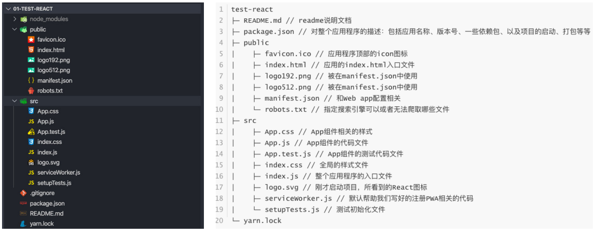

## create-react-app

**安装与创建**

```shell
npm install -g cnpm --registry=https://registry.npm.taobao.org
npm install create-react-app
create-react-app demo1 (项目名称/不能包含大写字母)
cd demo1
yarn start
```

**目录结构**



