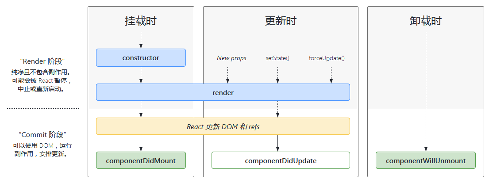
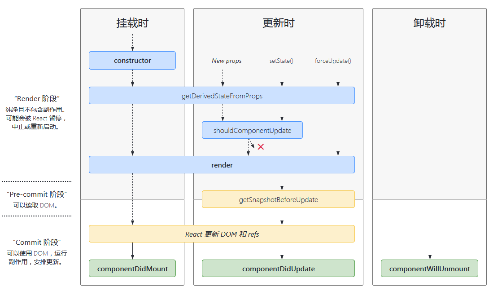
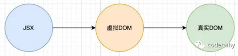
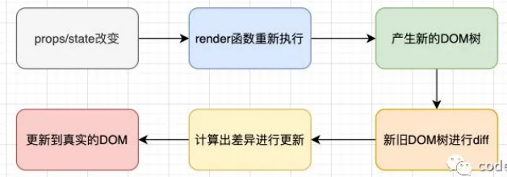
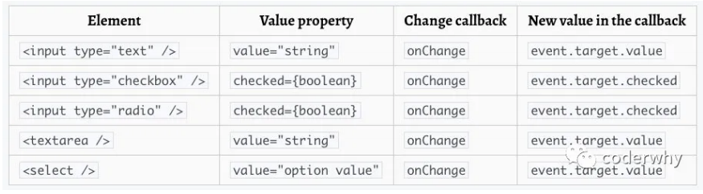

# react 组件化开发


## 组件的定义方式

### 函数组件

```jsx
function App() {
  return (
    <div className="App">
      函数式组件
    </div>
  );
}
```

- 不具备this(组件实例)
- 没有内部状态（state）
- 不具有生命周期


### 类组件

```jsx
import { Component } from "react";

class App extends Component {
  constructor(props) {
    super(props)
    this.state = {
      message: '类组件的内部状态'
    }
  }
  render() {
    return (
      <h2>{this.state.message}</h2>
    )
  }
}
```

- 类组件需继承自 `React.Component`
- 类组件必须实现 `render`方法
- 使用 `this.state` 维护组件内部的数据
- 当render被调用时，将检查 `this.state`和 `this.props`的变化并返回


### render函数的返回值

| 返回值类型          | 描述                                          |
| ------------------- | --------------------------------------------- |
| **React元素**       | 通过JSX创建，DOM节点或自定义组件都为react元素 |
| **数组或fragments** | 使得render函数可以返回多个元素                |
| **portals**         | 可以渲染子节点到不同DOM子树中                 |
| 字符串或数值        | 在DOM中渲染为文本节点                         |
| 布尔值或null        | 不进行渲染                                    |


## 类组件的生命周期





### 挂载阶段

——当组件实例被创建并插入 DOM 中时

#### **constructor()**

```js
constructor(props)
```

- 作用
  - 通过给 `this.state`赋值对象来初始化**内部state**
  - 为**事件处理函数**绑定实例 (this)
- 不初始化state 或者 不进行方法绑定，可不实现构造函数
- **不能调用 `setState()` 方法**


#### getDerivedStateFromProps()

```js
static getDerivedStateFromProps(props, state)
```

- 在调用 render 方法前调用，并且在初始挂载及后续更新时都被调用
- **返回一个对象来更新 state**，如果返回 null 则不更新任何内容
- 此方法无权访问组件实例


#### **render()**

```js
render()
```

- `render()` 方法是 class 组件中唯一必须实现的方法
- 当 `render` 被调用时，将检查 `this.props` 和 `this.state` 的变化并返回以下类型
  - **React 元素**
  - **数组或 fragments**
  - **Portals**
  - **字符串或数值类型**
  - **布尔类型或 `null`**

- `render()` 函数应为纯函数——在不修改组件 state 的情况下，每次调用时都返回相同的结果


#### **componentDidMount()**

```js
componentDidMount()
```

- 在组件挂载后（插入 DOM 树中）立即调用
- **使用场景**
  - 发送网络请求，获取数据
  - 添加订阅
  - 依赖于DOM的操作


### 更新阶段

——当组件的 props 或 state 发生变化时会触发更新

#### getDerivedStateFromProps()


#### shouldComponentUpdate() 

```js
shouldComponentUpdate(nextProps, nextState)
```

- 根据 `shouldComponentUpdate()` 的返回值，是否重新执行render方法
- 默认行为： state 每次发生变化组件都会重新渲染
- 首次渲染或使用 `forceUpdate()` 时不会调用该方法


#### **render()**


#### getSnapshotBeforeUpdate()

```js
getSnapshotBeforeUpdate(prevProps, prevState)
```

- 在最近一次渲染输出（提交到 DOM 节点）之前调用
- 让组件能**在发生更改之前从 DOM 中捕获一些信息**
- 返回值将作为参数传递给 `componentDidUpdate()`


#### **componentDidUpdate()**

```js
componentDidUpdate(prevProps, prevState, snapshot)
```

- 在更新后会被立即调用
- 首次渲染不会执行此方法


### 卸载阶段

#### **componentWillUnmount()**

```
componentWillUnmount()
```

- 在组件卸载及销毁之前直接调用
- `componentWillUnmount()` 中**不应调用 `setState()`**
- 使用场景
  - 清除 timer
  - 取消网络请求
  - 清除在 `componentDidMount()` 中创建的订阅


## 组件间的通信方式

### 父传子

- 父组件通过 **属性 = 值** 的形式给子组件传递数据
- 子组件通过 **props** 参数获取父组件传递的数据

```jsx
//父组件 app.js

import React, { Component } from 'react'

export default class App extends Component {
  render() {
    return (
      <div>
        {/*父组件传递数据*/}
        <ChildCom name="小鱼" age={18} level="20"></ChildCom>
        <ChildComF name="小曾" age={20} level="24"></ChildComF>
      </div>
    )
  }
}
```

**类组件**

```jsx
class ChildCom extends Component {
  constructor(props) {
    super(props)
  }
  render() {
    // 子组件解构数据并使用
    let {name, age, level} = this.props
    return (
      <div>
        <h2>姓名:{name} - 年龄: {age} - 等级: {level}</h2>
        <hr/>
      </div>
    )
  }
}
```

**函数组件**

```jsx

function ChildComF(props) {
    //函数组件不存在this,作为参数直接使用
    return (
      <div>
        <h2>姓名:{props.name} - 年龄: {props.age} - 等级: {props.level}</h2>
        <hr/>
     </div>
    )
}
```

**类型验证  props-type**

- 如果项目中默认继承 **Flow 或 TypeScript**，可直接进行类型验证
- 或者通过安装 `prop-types`库进行验证  `yarn add prop-types`

```js
//类组件
import PropTypes from "prop-types"

class ChildCom extends Component {
  // 使用静态属性
  static propTypes = {
    name: PropTypes.string.isRequired,
    age: PropTypes.number,
    level: PropTypes.number
  }
  static defaultProps = {
    name: '暂无',
    age: 0,
    level: 0
  }
  constructor(props) {
    super(props)
  }
  render() {
    let { name, age, level } = this.props
    return (
      <div>
        <h2>姓名:{name} - 年龄: {age} - 等级: {level}</h2>
        <hr />
      </div>
    )
  }
}
```

```jsx
//函数组件
//导入prop-types
import PropTypes from "prop-types"

function ChildComF(props) {
    return (
      <div>
        <h2>姓名:{props.name} - 年龄: {props.age} - 等级: {props.level}</h2>
        <hr/>
     </div>
    )
}

// 类型验证等 propTypes
ChildComF.propTypes = {
  name: PropTypes.string.isRequired,
  age: PropTypes.number,
  level: PropTypes.number
}
//指定 props 的默认值 defaultProps
ChildComF.defaultProps = {
  name: '暂无',
  age: 0,
  level: 0
}
```


### 子传父

- vue中通过自定义事件完成
- react中仍然通过**props**传递——**子组件保存父组件传递的回调函数引用，子组件调用该函数**


```jsx
import React, { Component } from 'react'

//子组件
class CountBtn extends Component {
    render() {
        // 子组件发生某些事件时，调用回调函数
        const {increment} = this.props
        return (
            <button onClick={increment}>+1</button>
        )
    }
}

//父组件
export default class App extends Component {
    constructor(props) {
        super(props)
        this.state = {
            counter: 0
        }
    }
    render() {
        return (
            <div>
                <h2>当前计数: {this.state.counter}</h2>
                <button onClick={e => this.increment()}>+</button>
                {/*通过props传递回调函数, 注意this的绑定*/}
                <CountBtn increment={e => this.increment()}></CountBtn>
            </div>
        )
    }
    increment() {
        console.log('increment函数被执行');
        this.setState({
            counter: this.state.counter + 1
        })
    }
}
```


## react实现slot效果

- 利用 `this.props.children`

```jsx
//父组件
render() {
    return (
      <div>
        <Test4>
          <strong>left</strong>
          <a herf="/#">百度一下</a>
          <span>right</span>
        </Test4>
      </div>
    )
}
//子组件
render() {
    return (
        <div className="navbar">
            <div className="nav-left">{this.props.children[0]}</div>
            <div className="nav-center">{this.props.children[1]}</div>
            <div className="nav-right">{this.props.children[2]}</div>
        </div>
    )
}
```

- 利用 `props` 与 JSX

```jsx
//父组件
render() {
    return (
      <div>
        <Test5 
            leftSlot={<strong>left</strong>} 
            centerSlot={<a herf="/#">百度一下</a>} 
            rightSlot={<span>right</span>}/>
      </div>
    )
}
//子组件
render() {
    const {leftSlot, centerSlot, rightSlot} = this.props
    return (
        <div className="navbar">
            <div className="nav-left">{leftSlot}</div>
            <div className="nav-center">{centerSlot}</div>
            <div className="nav-right">{rightSlot}</div>
        </div>
    )
}
```


## 跨组件通信 - 多级props

- **属性展开**——可以使用展开运算符在JSX中传递整个props对象 **{...this.props}**

```jsx
export default class Test6 extends Component {
    render() {
        return (
            <ToolBar theme="dark" color="red"></ToolBar>
        )
    }
}
class ToolBar extends Component {
    render() {
        return (
            <ThemeButton {...this.props}></ThemeButton>
        )
    }
}
function ThemeButton(props) {
    return (
        <button 
            style={{backgroundColor: props.theme, color: props.color}}
        >主题按钮</button>
    )
}
```


## 跨组件通信 - Context

- 用于共享在组件树中的全局数据，如：用户数据、主题、语言等

- **React.createContext**

  - 创建一个Context对象，当 React 渲染一个订阅了这个 Context 对象的组件，该组件会从组件树中离自身最近的那个匹配的 `Provider` 中读取到当前的 context 值
  - **只有**当组件所处的树中没有匹配到 Provider 时，其 `defaultValue` 参数才会生效

  ```js
  const MyContext = React.createContext(defaultValue)
  ```

  

- **Content.Provider**

  - 每个 Context 对象都会返回一个 **Provider React 组件，允许消费组件订阅 context 的变化**
  - Provider 接收一个 `value` 属性，传递给消费组件
  - 当 Provider 的 `value` 值发生变化时，它内部的所有消费组件都会重新渲染
  - Provider 及其内部 consumer 组件都不受制于 `shouldComponentUpdate` 函数

  ```html
  <MyContext.Provider value={/*某个值*/}>
  ```


- **Class.contextType**

  - 挂载在 class 上的 `contextType` 属性会被重赋值为一个由 React.createContext() 创建的 Context 对象
  - 使用 `this.context` 来消费最近 Context 上的那个值

  ```jsx
  class MyClass extends React.Component {
    componentDidMount() {
      let value = this.context;
      /* 在组件挂载完成后，使用 MyContext 组件的值来执行一些有副作用的操作 */
    }
    render() {
      let value = this.context;
      /* 基于 MyContext 组件的值进行渲染 */
    }
  }
  MyClass.contextType = MyContext;
  ```

  

- **Context.Consumer**

  - 让函数式组件完成订阅 context

  ```jsx
  <MyContext.Consumer>
  	{value => /*基于context值进行渲染*/}
  </MyContext.Consumer>
  ```

- **Context.displayName**

  - React DevTools 使用该字符串来确定 context 要显示的内容

  ```js
  const MyContext = React.createContext(/* some value */);
  MyContext.displayName = 'MyDisplayName';
  ```


**实例：单个Context**

```jsx
// 1.创建Content,提供默认值
const ThemeContext = React.createContext({
    color: 'pink',
    fontSize: 24
})

export default class Test7 extends Component {
    constructor(props) {
        super(props)
        this.state = {
            themeObj : { 
                color: 'blue',
                fontSize: 20
            }
        }
    }
    render() {
        return (
            // 2.提供当前Content对象的值
            <ThemeContext.Provider value={this.state.themeObj}>
                <ToolBar></ToolBar>
            </ThemeContext.Provider>
        )
    }
}
class ToolBar extends Component {
    render() {
        console.log(this.context);
        return (
            <ThemeButton></ThemeButton>
        )
    }
}

class ThemeButton extends Component {
    // 3.消费当前Content,值保存在this.context
    static contextType = ThemeContext
    render() {
        console.log(this.context);
        return (
            <button style={{
                    fontSize: this.context.fontSize + 'px', 
                    color: this.context.color}}
            >主题按钮</button>
        )
    }
}
```

```jsx
// 函数式
function ThemeButton() {
    return (
        <ThemeContext.Consumer>
            {
                value => {
                    return (
                        <button style={{fontSize: value.fontSize + 'px', color: value.color}}>主题按钮</button>
                    )
                }
            }
        </ThemeContext.Consumer>
    )
}
```


### 跨组件通信——eventBus

```shell
yarn add events
```

**events常用API**

- 创建EventEmitter对象：eventBus对象
- 发出事件：`eventBus.emit('事件名称', 参数列表)`
- 监听事件：`eventBus.addListener('事件名称',监听函数)`
- 移除事件：`eventBus.removeListener('事件名称', 监听函数)`

```js
// eventBus.js
import { EventEmitter } from 'events'
const eventBus = new EventEmitter()
export default eventBus
```

```js
//发出事件
import eventBus from '../utils/eventBus'
 handleEmitEvent = () => {
    eventBus.emit('test15', '来自page15的消息', 2348349)
}
```

```js
//接收事件
import eventBus from '../utils/eventBus'
componentDidMount() {
    eventBus.addListener('test15', (message, num) => {
      console.log('监听到事件test15', message, num);
    })
}
componentWillUnmount() {
    eventBus.removeListener('test15', (message, num) => {
      console.log('监听到事件test15', message, num);
    })
}
```


## setState的使用

- React 日常的使用中，不要直接去修改 state

- **`this.state.count = 1`是无法触发 React 去更新视图的**；React的机制规定，一个state的更新，首先需要调用 setState 方法

- React不具备Vue的 `Object.defineProperty`或 `Proxy`监听数据变化

  

### setState异步更新

- setState是异步操作， **立马执行之后，是无法直接获取到最新的 state 的**
  - 需要经过 React 对 state 的所有改变进行合并处理
  - 计算新的虚拟dom
  - 再根据最新的虚拟dom去重新渲染真实dom

```js
changeText() {
    this.setState({
        message: "你好 react！！"
    })
    console.log('点击改变文本后', this.state.message); // 'hello world'
}
```

**setState设计为异步的原因**

- 显著提升性能
  - 若每次调用setState都进行更新，将频繁调用render函数，界面重新渲染，效率较低
  - 实际上，react获取多个更新后进行合并后调用render
- 若同步执行state，但未执行render函数，state和props不能保存同步


**获取异步更新的结果**

- **setState的回调函数**  `setState(partialState, callback)`

  - 回调函数将在更新后执行

  ```js
  changeText2() {
      this.setState({
          message: "你好 react！！"
      }, () => {
          console.log('setState回调函数后', this.state.message);
          // "你好 react！！"
      })
  }
  ```

- 生命周期 `componentDidUpdate(prevProps, prevState, snapshot)`

  ```js
  componentDidUpdate(prevProps, prevState, snapShot) {
      console.log(prevProps, prevState);
      console.log(this.state.message);
  }
  ```

  

### setState同步调用的方式

```jsx
export default class Test11 extends Component {
    state = {
      count: 0
    };
  
    componentDidMount() {
      // 生命周期中调用
      this.setState({ count: this.state.count + 1 });
      console.log("生命周期调用后: " + this.state.count);
    
      // setTimeout中调用
      setTimeout(() => {
        this.setState({ count: this.state.count + 1 });
        console.log("setTimeout调用后: " + this.state.count);
      }, 0);

      document.getElementById("div2").addEventListener("click", this.increment2);
    }
  
    increment = () => {
      // 合成事件中调用
      this.setState({ count: this.state.count + 1 });
      console.log("react event: " + this.state.count);
    };
  
    increment2 = () => {
      // 原生事件中调用
      this.setState({ count: this.state.count + 1 });
      console.log("dom event: " + this.state.count);
    };
  
    render() {
      return (
        <div className="App">
          <h2>当前计数: {this.state.count}</h2>
          <button id="div1" onClick={this.increment}>
            react事件 + 1
          </button>
          <button id="div2">DOM事件 + 1</button>
        </div>
      );
    }
  }
```

- **react事件机制**——为了解决跨平台，兼容性问题，React封装一套事件机制，代理原生的事件
- **异步setState**：组件生命周期或React合成事件
- **同步setState**：setTimeout或原生dom事件中

> 根本原因在于，setState并不是真正意义上的异步操作，它只是**模拟了异步的行为**。**React中会去维护一个标识（`isBatchingUpdates`），判断是直接更新还是先暂存state进队列**。`setTimeout`以及原生事件都会直接去更新state，因此可以立即得到最新state。而合成事件和React生命周期函数中，是受React控制的，其会将`isBatchingUpdates`设置为 `true`，从而类似异步


### setState数据的合并

- 通过 `Object.assign`对原有state和当前改变的state进行浅拷贝

  ```js
  return Object.assign({}, prevState, partialState)
  ```

  

### 多个setState的合并

```js
increment = () => {
  // 多重调用setState
  console.log('第一次调用时count', this.state.count);
  this.setState({ count: this.state.count + 1 });
  console.log('第二次调用时count', this.state.count);
  this.setState({ count: this.state.count + 1 });
  console.log('第三次调用时count', this.state.count);
  this.setState({ count: this.state.count + 1 });
};
```

- 实际最终的 count 会等于 1，原因是执行时得到的 this.state.count = 0

- setState()实际上可以**接受一个函数作为参数**，函数的首个参数就是上一次的state

```js
this.setState(prevState => {count: prevState.count + 1});
this.setState(prevState => {count: prevState.count + 1});
this.setState(prevState => {count: prevState.count + 1});
```


## React的更新机制

**渲染流程**



**更新流程**




### diff算法——优化 O(n)

- 同层次节点之间相互比较，不会跨节点比较
- 不同类型的节点，产生不同的树结构
- 通过指定key保存某些节点在不同渲染下的稳定


**情况一：对比不同类型的元素**

- 当节点为不同的元素，React会**拆卸原有的树**，并且建立起新的树，并且内部**相同组件不会复用**

  - 如：一个元素从 <a> 变成 ，从 <Article> 变成 <Comment>

  - 当卸载一棵树时，对应的DOM节点也会被销毁，组件实例将执行 `componentWillUnmount()`

  - 当建立一棵新的树时，对应的 DOM 节点会被创建以及插入到 DOM 中，组件实例执行 `componentDidMount()`

    

**情况二：对比同一类型的元素**

- 比对两个相同类型的 React 元素时，React 会**保留 DOM 节点，仅比对及更新有改变的属性**
- 同类型的组件元素
  -  组件会保持不变，React**更新该组件的props**，并且调用`componentWillUpdate()` 
  - 调用 render() 方法，diff 算法将在之前的结果以及新的结果中进行递归


**情况三：对子节点进行递归**

- 在默认条件下，当递归 DOM 节点的子元素时，React 会同时遍历两个子元素的列表；**当产生差异时，生成一个mutation**
- 在列表数据中间插入，将产生多个mutation，效率低下


### keys的优化

- 在最后位置插入数据，key意义不大
- 在前面插入数据，没有key所有列表项将进行更新


## render函数调用

- 当App的render函数被调用时，所有的子组件的render函数都会被重新调用
- 只要是修改App中的数据，所有的组件都需要重新render，进行diff算法，性能必然是很低的
- **调用render应该有一个前提，就是依赖的数据（state、 props）发生改变时，再调用自己的render方法**


### 类组件 — shouldComponentUpdate

- 参数
  - nextProps 修改之后，最新的props属性
  - nextState 修改之后，最新的state属性
- 返回值
  - 默认返回的是true，调用render方法

```js
shouldComponentUpdate(nextProps, nextState) {
    if(this.state === nextState) return false
    return true
}
```


### 类组件——PureComponent

- 将class继承自PureComponent，React将自行调用 `shouldComponentUpdate()`

  ```js
  Object.assign(pureComponentPrototype, Component.prototype)
  pureComponentPrototype.isPureReactComponent = true
  ```

- 调用 `shallowEqual`方法进行浅层比较，判断是否调用render函数


### 函数组件——高阶组件memo

- React.memo 仅检查 props 变更

```js
const MyComponent = React.memo(function MyComponent(props) {
  /* 使用 props 渲染 */
});
```

```js
const Header = memo(
  function Header() {
    console.log('render调用-Header');
    return (
      <h4>我来组成头部</h4>
    )
  }
)
```


## 使用ref

某些特殊的情况，需要获取到DOM进行某些操作

- 管理焦点，文本选择或媒体播放
- 触发强制动画
- 集成第三方 DOM 库

**创建ref获取对应DOM**

- 传入字符串
  - 通过 `this.refs`加上传入字符串获取对应DOM
- 传入对象
  - 通过 `React.createRef()`创建的对象
  - 使用时，获取创建对象的current属性
- 传入函数
  - 函数在DOM被挂载时进行回调，函数会传入元素对象可进行保存
  - 使用时，获取保存的元素对象

```jsx
import React, { PureComponent, createRef } from 'react'

constructor(props) {
    super(props)
    this.objectRef = createRef()
    this.functionRef = null
}
render() {
    return (
        <div>
            {/* ref属性可传入 字符串 对象 函数*/}
            <h2 ref="stringRef">hello react</h2>
            <h2 ref={this.objectRef}>hello react</h2>
            <h2 ref={(element) => {this.functionRef = element}}>hello react</h2>
            <button onClick={this.handleRefString}>ref-string</button>
            <button onClick={this.handleRefObject}>ref-object</button>
            <button onClick={this.handleRefFunction}>ref-function</button>
        </div>
    )
}
```


**ref的类型**

- 当 ref 属性**用于 HTML 元素时**
  - 构造函数中使用 React.createRef() 创建的 ref 接收**底层 DOM 元素**作为其 current 属性
-  ref 属性**用于自定义 class 组件时**
  - ref 对象接收**组件的挂载实例**作为其 current 属性
- **不能在函数组件上使用 ref 属性**，不具备组件实例
  - 通过 `React.forwardRef` 获取其DOM


## 受控组件与非受控组件

- 在 HTML 中，表单元素（如<input>、 <textarea> 和 <select>）之类的**表单元素通常自己维护 state，并根据用户输入进行更新**
- 在 React 中，可变状态（mutable state）通常保存在**组件的 state 属性中，并且只能通过使用 setState()来更新**


**受控组件**——两者结合 state 成为“唯一数据源”，控制取值的表单输入元素

- 唯一数据源：表单元素上设置 value 属性，显示的值将始终为 this.state.value
- 控制并更新用户： `onChange`执行并更新 React 的 state




## 高阶组件 HOC

- 具体而言，高阶组件是参数为组件，返回值为新组件的函数
- 组件是将 props 转换为 UI，而高阶组件是将组件转换为另一个组件

```jsx
//高阶组件定义-class
function heightOrederComponent(WrappedComponent) {
    class WithComponent extends PureComponent {
        render() {
            return <WrappedComponent {...this.props} />
        }
    }
    withComponent.displayName = 'WithWrappedComponent' //修改该组件类名
    return WithComponent
}

//高阶组件定义-function
function heightOrederComponent(WrappedComponent) {
    function withComponent(props) {
       return <WrappedComponent {...props}/>
    }
    withComponent.displayName = 'WithWrappedComponent' //修改该组件类名
    return WithComponent
}
```

```jsx
//高阶组件使用
const EnhancedComponent = higherOrderComponent(WrappedComponent);
```


## 内容补充

### ref转发

函数式组件没有实例，不能获取到对应的组件对象，**通过 forwradRef 高阶函数**

```jsx
import React, { PureComponent, createRef, forwardRef } from 'react'

const Home = forwardRef(
  function(props, ref) {
    return (
      <div>
        <div ref={ref}>Home Page</div>
      </div>
    )
  }
)

render() {
    <Home ref={this.funcRef}></Home>
}
```


### Portals的使用

- 某些情况下，希望渲染的内容独立于父组件，甚至是独立于当前App组件挂载到的DOM元素中
- Portal 提供一种**将子节点渲染到存在于父组件以外的 DOM 节点**的方案
- `ReactDOM.createPortal(child, container)`
  - child：是任何可渲染的 React 子元素，例如一个元素，字符串或 fragment
  - container：一个 DOM 元素； 

```jsx
import ReactDOM from 'react-dom';

class Model extends PureComponent {
  render() {
    return ReactDOM.createPortal(
        this.props.children, 
        document.getElementById('model'))
  }
}

```


### fragment

- Fragment 允许你将子列表分组，而无需向 DOM 添加额外节点
- 短语法
  - 空标签 <> </>，**不能添加key属性**

