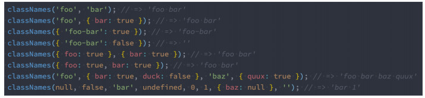

# React中的样式


## 内联样式

- style属性接受以**小驼峰命名的JS对象**

**优点**

- 内联样式，不会产生样式冲突
- 可以动态获取当前state的状态

  **缺点**

- 写法上需要使用驼峰标识
- 某些样式没有智能提示
- 大量的样式，代码混乱
- 伪类、伪元素等样式无法编写

```jsx
<h2 style={{color: this.state.color}}>test1 page title</h2>
 <p style={testStyle}>一段文字描述</p>
```


## 普通CSS

- 通常编写到单独文件，再进行引入

**优点**

- 符合普通页面开发标准

**缺点**

- 属于全局CSS 样式之间相互影响

```jsx
import React, { PureComponent } from 'react'
import './index.css'

export default class Header extends PureComponent {
    render() {
        return (
            <div className="header">
                <h4 className="title">header title</h4>
                <p>一段内容</p>
            </div>
        )
    }
}
```


## CSS modules

- React脚手架已内置css modules的配置
- css/.less/.scss 等样式文件都修改成 .module.css/.module.less/.module.scss 等

**优点**

- 解决局部作用域的问题

**缺点**

- 引用的类名不能使用短横线连接 `.home-title`， 在JS中不识别
- 所有className都需要使用 `style.className`的形式编写
- 不方便动态修改某些样式，需要使用内联样式模式


## CSS in JS

-  CSS-in-JS通过JavaScript来为CSS赋予一些能力
  - 类似于CSS预处理器一样的样式嵌套、函数定义、逻辑复用、动态修改状态等等
- CSS-in-JS的库
  - `styled-components`
  - ` emotion`


### styled-components

```shell
yarn add styled-components
```


> 模板字符串调用函数
>
> ```js
> function foo(...args) {
>     console.log(args)
> }
> let baz = 'baz'
> let bar = 'bar'
> const str = `一个字符串${baz},另一个字符串${bar}`
> 
> foo`一个字符串${baz},另一个字符串${bar}`
> //[Array(3), "baz", "bar"]
> 
> foo(str) 
> //["一个字符串baz,另一个字符串bar"]
> ```


**styled-components的本质是通过函数的调用，最终创建出一个组件**

- 该组件会主动添加不重复的class

- **styled-components**会给该class添加相关的样式；

- **props**可以穿透，传递给styled组件

  - 获取props通过 ${} 传入一个插值函数，props作为该函数的参数

- 添加  **attrs 属性**可作为props使用

  ```js
  import styled from 'styled-components'
  
  export const HeaderWrapper = styled.div.attrs({
      contentColor: '#f429e4'
  })`
      font-size: 18px;
      font-weight: 600;
      border: 1px solid #000;
      border-radius: 30px;
      .tilte {
          color: ${props => props.color}
      }
      .content {
          color: ${props => props.contentColor}
      }
  `
  ```

  ```jsx
  import {HeaderWrapper} from './style'
  
  export default class Header extends PureComponent {
      constructor(props) {
          super(props)
          this.state = {
              color: '#f4f400'
          }
      }
      render() {
          return (
              <HeaderWrapper color={this.state.color}>
                  <h4 className="tilte">header title</h4>
                  <p className="content">一段内容</p>
              </HeaderWrapper>
          )
      }
  }
  ```

  

### styled高级特性

**支持样式继承**

```js
const Button = styled.button`
	color: #ffee44;
	border-radius: 5px;
`
const WarnButton = styled(Button)`
	background-color: red;
`
```

**设置主题颜色**

```jsx
import styled, { ThemeProvider } from 'styled-components';

export default class App extends PureComponent {
  render() {
    return (
      <ThemeProvider theme={{themeColor: "red", fontSize: "30px"}}>
        <Home />
      </ThemeProvider>
    )
  }
}

const Home = styled.div`
	font-size: ${props => props.theme.fontSize};
	color: ${props => props.theme.themeColor};
`
```


## React中添加class

- 借助于一个第三方的库：**classnames**

  