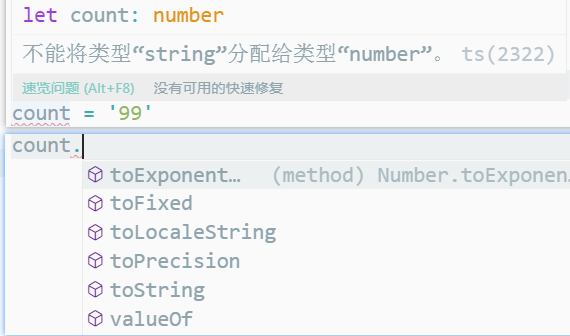

## TypeScript 图文教程——技术胖

- TypeScript 是由微软公司在 2012 年正式发布
- TypeScript 是 JavaScript 的**超集**，建立在 JavaScript 之上的


## 开发环境搭建


1. 安装node `node --version`

2. 全局安装typescript 

   ```shell
   npm install typescript -g
   yarn global add typescript 
   ```

3. 建立项目目录，编译TS文件

   > node 不能直接运行ts文件 

   ```shell
   d:
   mkdir TypeScriptDemo
   tsc Demo1.ts //将ts代码编译为js代码
   ```

4. ts-node 安装与使用

   > 使node环境具有执行ts文件的能力

   ```shell
   npm install ts-node -g
   ts-node Demo1.ts
   ```

   

## TypeScript静态类型

- **定义静态类型**：一旦定义，变量的类型不能改变

  - `.`使用该类型的属性和方法

  ```ts
  //数字类型
  let count: number = 99
  ```

  

- **自定义静态类型**

  ```ts
  interface Xiaojiejie {
      name: string,
      age: number,
  }
  const xiaoYu: Xiaojiejie = {
      name: '小鱼',
      age: 18
  }
  ```


**基础静态类型**

```ts
//布尔值
let isDone: boolean = false;
// 数字 —— 所有数字为浮点数
let count: number = 99;
let hexNumber: number = 0xfood;
// 字符串 
let name: string = 'xiaoYu';
let sayHello: string = `Hello, my name is ${name}`

//null undefined —— 不能再赋值
//默认情况下, null 和 undefined 是所有类型的子类型, 可以赋值给其他类型
let u: undefined = undefined;
let n: null = null;
```

```ts
//any ——不清楚变量的类型 类型检测器编译阶段不进行检查
let notSure: any = 4;
notSure = 'maybe a string instead';

//void ——表示没有任何数据类型  没有返回值可使用
function warnUser(): void {
    console.log('this is my warning message')
}

//never ——表示永不存在值的类型，如抛出异常
function error(message: string): never {
    throw new Error(message);
}
function infiniteLoop() :never {
    while(true) {
        
    }
}
```


**对象类型**

```ts
// 对象类型
const xiaoYu: {
    name: string,
    age: number
} = {
    name: 'xiaoYu',
    age: 18
}

// 数组类型
const stars: String[] = ['刘诗诗', '唐嫣', '杨幂']

//类类型
class Person {}
let xiaoYu: Person = new Person();

// 函数类型
let fn: () => string = () => {
    return ''
}

```


## TypeScript 的类型注释和类型推断

**type annotation 类型注解**

如上

**type inferrence 类型推断**

> 推断发生在初始化变量和成员，设置默认参数值和决定函数返回值时

> 如果 `TS` 能够自动分析变量类型， 就不需要类型注解

- 可以推测对象属性的类型

```ts
const one = 1;
const two = 2;
const three = one + two;
```

> 如果 TS 无法分析变量类型的话， 需要使用类型注解

```ts
function getTotal(one, two) {
  return one + two;
}
const total = getTotal(1, 2);
```


### TypeScript函数参数和返回值定义

- 普通函数

  ```ts
  function getToal(one: number, two: number): number {
      return one + two
  }
  const total = getToal(1,2)
  ```

- 函数无返回值

  ``` ts
  function sayHello(): void {
      console.log("hello world")
  }
  ```

- never返回值类型

  - 函数执行不会结束

  ```ts
  function error(message: string): never {
      throw new Error(message);
  }
  function infiniteLoop() :never {
      while(true) {
          
      }
  }
  ```

- 函数参数——对象结构

  ```ts
  function add({one, two}: {one: number, two: number}) {
  	return one + two
  }
  const total = add({ one: 1, two: 2 });
  ```

  

## TypeScript数组类型定义

- 一般数组

  ```ts
  const numberArr: number[] = [1, 2, 3];
  const stringArr: string[] = ["a", "b", "c"];
  const undefinedArr: undefined[] = [undefined, undefined];
  
  //多类型数组
  const arr: (string | number)[] = [1, 'string', 2]
  ```

- 数组中对象类型

