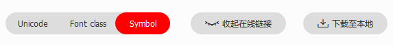
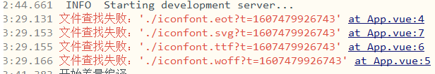
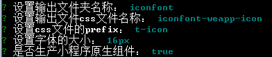

### 自适应方形图片

- 利用margin或者padding的百分比计算是参照父元素的width属性

  > https://segmentfault.com/a/1190000004231995

```css
.box3 {
    width: 50%; 
    position: relative;
    overflow: hidden;
    border-radius: 20px;
    max-height: 500px;
    max-width: 500px;
  }
  .box3::after {
    content: '';
    display: block;
    padding-bottom: 100%; //伪元素高度撑开父元素的宽度
  }
  .box3 > img {
    position: absolute; //内容以绝对定位放置
    object-fit: cover;
    width: 100%;
    height: 100%;
  }
```


### 毛玻璃效果

- `backdorp-filter`：为一个元素后面区域添加图形效果

```css
.glass {
    backdrop-filter: blur(10px);
    -webkit-backdrop-filter: blur(10px);
}`
```

- `filter: blur()`：

  - 元素上所有内容进行模糊，为实现文字不模糊效果需对单一内容层进行模糊
  - 模糊效果不会作用于后面元素，需对背景图片相同区域进行模糊
- `overflow:hidden`——防止边框不清晰
  - `background-attachment:fiexd`——填充图片大小与背景相同
  
  ```css
  .box2 {
      width: 100vw;
      height: 100vh;
      background-image: url(./images/img1.jpeg);
      background-position: center center;
      background-size: cover;
      background-attachment: fixed;
  
      display: flex;
      justify-content: center;
      align-items: center;
    }
  
    .box2 > .glass {
      width: 100vw;
      height: 20vh;
      text-align: center;
      line-height: 20vh;
      position: relative;
      z-index: 1;
      overflow:hidden;
    }
    .box2 > .glass::after {
      content: '';
      position: absolute;
      z-index: -1;
      top: 0;
      bottom: 0;
      left: 0;
      right: 0;
      background-image: url(./images/img1.jpeg);
      background-position: center center;
      background-size: cover;
      background-attachment: fixed;
      filter: blur(5px);
    }
  ```
  
  > https://www.cnblogs.com/ghost-xyx/p/5677168.html

### uni-app软件云打包

### 微信登录授权

> https://ask.dcloud.net.cn/article/192
>
> https://developers.weixin.qq.com/doc/oplatform/Mobile_App/WeChat_Login/Development_Guide.html

- 微信/QQ/微博开放平台申请**获取配置参数**

  - **实现微信授权**：在[微信开放平台](https://open.weixin.qq.com/)申请一个应用，获取相应的appid和appsecret

- 在uniapp项目中manifest.json 进行**APP SDK配置** 和 **模块权限配置**

  - 微信小程序配置：添加微信小程序的 appID

  - App模块权限配置：勾选上 OAuth登录鉴权 选项

  - App SDK配置：登录鉴权-微信登录-添加appid 和 appsecret

    

- APP端微信授权

  ```html
  <!-- #ifdef APP-PLUS -->
  	<button class="" @click="appLogin">APP微信授权登录</button>
  <!-- #endif -->
  ```

  ```js
  methods:{
          appLogin(e) {
              // 获取服务提供商
              uni.getProvider({
                  service: "oauth",
                  success: res => {
                      // 用于验证App端是否配置微信模块
                      if (~res.provider.indexOf('weixin')) {
                          uni.login({
                              provider:"weixin",
                              success: loginRes => {
                                  this.getApploginData(loginRes.authResult)
                              },
                              fail() {
                                  console.log("App微信获取用户信息失败");
                              }
                          })
                      }
                  }
              })
          },
          getApploginData(authResult) {
              // code为微信小程序独有
              // 获取用户信息 在小程序 withCredentials 为 true 时或是在 App 调用 uni.getUserInfo，要求此前有调用过 uni.login 且登录态尚未过期
              uni.getUserInfo({
                      provider: 'weixin',
                      success: function(infoRes) {
                          console.log('-------获取微信用户所有-----');
                          console.log(JSON.stringify(infoRes.userInfo));
                      }
              });
          }
      }
  ```

- 小程序微信登录

  ```html
  <!-- #ifdef MP-WEIXIN -->
  	<button type="default" open-type="getUserInfo" @getuserinfo="getUserInfo" withCredentials="true">小程序登录</button>
  <!-- #endif -->
  ```

  ```js
  methods: {
      getUserInfo(res) {
          uni.login({
              provider: 'weixin',
              success: function(loginRes) {
                  console.log(loginRes);
                  // 获取用户信息
                  uni.getUserInfo({
                      provider: 'weixin',
                      success: function(infoRes) {
                          console.log(infoRes.userInfo);
                      }
                  });
              }
          });
      },
  }
  ```

  

### 微信支付宝付款接口

> https://www.cnblogs.com/ts119/p/13749318.html
>
> https://uniapp.dcloud.io/api/plugins/payment?id=orderinfo

- 配置`manifest.json`，选择App模块配置，勾选Payment支付；根据业务需要再勾选支付宝和微信支付

  

- 页面代码实现

  ```html
  <view class="pay">
      <u-radio-group v-model="value">
          <u-radio 
              v-for="(payItem, index) in payList" 
              :key="payItem.name" 
              @change="radioChange"
              :name="payItem.name"
              >
              <text class="iconfont" :class="payItem.icon"></text>
              {{payItem.name}}
          </u-radio>
      </u-radio-group>
      <u-field
          v-model.number.trim="price"
          label="金额"
          placeholder="请输入充值金额"
      >
      </u-field>
      <u-button @tap="payOrder">确认支付</u-button>
  </view>
  ```

- 代码逻辑实现

  - 通过后端获取到订单信息；再通过订单信息获取到服务商信息和支付配置信息
  - 通过 uni.requestPayment 支付

```vue
<template>
	<view class="pay">
		<u-radio-group v-model="payType">
			<u-radio 
				v-for="(payItem, index) in payList" 
				:key="payItem.name" 
				@change="radioChange"
				:name="payItem.name"
				>
				<text class="iconfont" :class="payItem.icon"></text>
				{{payItem.name}}
			</u-radio>
		</u-radio-group>
		<u-field
			v-model.number.trim="price"
			label="金额"
			placeholder="请输入充值金额"
		>
		</u-field>
		<u-button @tap="payOrder">确认支付</u-button>
	</view>
</template>

<script>
	export default {
		data() {
			return {
				price: '',
				payType: '微信支付',
				payList: [
					{
						name: '微信支付',
						icon: 'icon-weixinzhifu'
					},
					{
						name: '支付宝支付',
						icon: 'icon-zhifubaozhifu'
					},
				]
			}
		},
		methods:{
			radioChange(e) {
				this.value = e
			},
			payOrder() {
				if(typeof this.price !== 'number' || !this.price) {
					uni.showToast({
						title:"请填写正确的输入金额",
						icon:"none"
					})
					return
				}
				this.getPayParams()
			},
			async getPayParams() {
				let params, payType;
				payType = this.payType === '微信支付' ? 2 : 1;
				params = {
					money: this.price,
					pay_type: payType 
				}
				// #ifdef APP-PLUS
				uni.showLoading({
					title:"支付请求中"
				})
				// #endif
				let res = await this.$service.index.rechargeHeartCoin(params)
				console.log(res.data.data);
				// #ifdef APP-PLUS
				if(res.data.code === 0) {
					this.PayOrder(payType, res.data.data)
				}
				// #endif
				// #ifdef H5
					this.$util.showToast('请前往App端进行支付')
				// #endif
			},
			async PayOrder(payType, orderInfo) {
				let provider = payType === 2 ? 'wxpay' : 'alipay'
				uni.hideLoading()
				uni.requestPayment({
					provider,
					orderInfo,
					success: () => {
						this.$util.showToast('支付成功')
					},
					fail: () => {
						this.$util.showToast('支付失败')
					},
					complete: () => {
						this.price = ''
					}
				})
			}
			
		},
		computed:{
			
		},
	}
</script>

<style lang="scss" scoped>

</style>
```


### uni高性能列表（nvue）

### uni多色图标

> https://blog.csdn.net/qq_43408070/article/details/110917674

**方法一**：涉及DOM APP报错

```
Cannot read property 'getElementsByTagName' of undefined
```

1. 阿里图标库下载图标

   

2. 创建文件夹放入必需的文件 （**eot svg ttf woff css js**）

3. 全局 `app.vue`中引入 `iconfont.css`

   - 报错在iconfont.css中引入字体文件前加 `/`

     

   - 添加通用样式

     ```css
     <style type="text/css">
         .icon {
            width: 1em; height: 1em;
            vertical-align: -0.15em;
            fill: currentColor;
            overflow: hidden;
         }
     </style>
     ```

4. main.js中引入

   ```js
   // 多色图标
   import '@/static/font/colorFont/iconfont.js'
   ```

5. 挑选相应图标并获取类名，应用于页面

   ```html
   <svg class="icon" aria-hidden="true">
       <use xlink:href="#icon-xxx"></use>
   </svg>
   ```

**方法二**

> https://www.cnblogs.com/caijinghong/p/13432906.html

1. 下载图标

2. 按照 `iconfont-tools`

   ```
   npm install -g iconfont-tools
   ```

3. 在解压文件夹执行 `iconfont-tools`

   

4. 将`iconfont-weapp-icon.css`复制到 static 文件中，并在 **app.vue中导入**

   ```css
   @import './static/css/iconfont-weapp-icon.css';
   ```

5. 使用格式

   ```html
   <view class="t-icon t-icon-heart"></view>
   ```

   ```css
   .t-icon-heart {
   	width: 100rpx;
       height: 100rpx
   }
   ```

   

### uni获取元素节点信息

### nvue设置字体图标

> https://www.cnblogs.com/DeerLin/p/13326888.html	
>
> https://uniapp.dcloud.io/nvue-api

```vue
<!--使用unicode的形式-->
<text class="iconfont icon-right">&#xe601;</text>
<!--图标内容使用data里的变量-->
<text :style="{fontFamily:'iconfont',color:'red',fontSize:'40px'}">{{fontName}}</text>

<script>
data:{
    return {
          fontName: "\ue64e",
    }
},
created() {
    let domModule = weex.requireModule("dom");
				domModule.addRule('fontFace', {
					   'fontFamily': 'iconfont',
					   'src': "url(\'http://at.alicdn.com/t/font_2134639_4vhqwg1qsky.ttf\')"
				})
}
</script>
<style>
    .iconfont {
	    font-family: iconfont;
		font-size: 32rpx;
		position: relative;
		top: 2rpx;
	}
    .icon-right {
	    color: #ff7243;
		font-weight: 500;
	}
</style>
```


### NVUE 使用注意事项

在APP端，内置基于weex原生渲染引擎

- 使用vue页面，使用webview渲染
- 使用 native vue 页面，使用原生渲染

**使用nvue作为性能补充的场景**

- 高性能的区域长列表或瀑布流滚动——需要使用nvue的`list`、`recycle-list`、`waterfall`等组件
- 高性能的自定义下拉刷新——使用nvue的refresh组件
- 左右拖动的长列表
- 实现区域滚动长列表+左右拖动列表+吸顶的复杂排版效果
- 聊天场景
- 解决前端控件无法覆盖原生控件的层级问题——如`map`、`video`、`live-pusher`等
- 直播推流：nvue下有`live-pusher`组件
- App启动速度要求极致化——首页nvue且在manifest里配置fast模式

**纯原生渲染模式**

- manifest.json源码视图的`"app-plus"`下配置`"renderer":"native"`

  - vue组件将以原生渲染引擎来渲染

    ```json
      // manifest.json    
    {    
         // ...    
        /* App平台特有配置 */    
        "app-plus": {    
            "renderer": "native", //App端纯原生渲染模式
        }    
    }
    ```

**编译模式**

```json
// manifest.json    
{    
    // ...    
    /* App平台特有配置 */    
    "app-plus": {    
        "nvueCompiler":"uni-app" //是否启用 uni-app 模式  
    }    
}
```

|          | weex编译模式                      | uni-app编译模式                    |
| -------- | --------------------------------- | ---------------------------------- |
| 平台     | 仅App                             | 所有端，包含小程序和H5             |
| 组件     | weex组件如div                     | uni-app组件如view                  |
| 生命周期 | 只支持weex生命周期                | 支持所有uni-app生命周期            |
| JS API   | weex API、uni API、Plus API       | weex API、uni API、Plus API        |
| 单位     | 750px是屏幕宽度，wx是固定像素单位 | 750rpx是屏幕宽度，px是固定像素单位 |
| 全局样式 | 手动引入                          | app.vue的样式即为全局样式          |
| 页面滚动 | 必须给页面套或组件                | 默认支持页面滚动                   |


### 快速上手

**新建nvue页面**

- 都需在 `page.json`注册
- 同名——app端使用nvue页面，非app端使用vue页面
- 仅有nvue页面——非app端，在uni-app编译模式下才能编译

**开发nvue页面**

- 由于采用原生渲染，**并非所有浏览器的 css 均支持，布局模型只支持 flex 布局**


### nvue开发与vue开发的常见区别

- nvue 页面控制显隐只可以使用`v-if`不可以使用`v-show`
- nvue 页面只能使用`flex`布局
- nvue 页面的布局排列方向默认为竖排（`column`）
- 文字内容，只能在`<text>`组件下
- 文字内容，必须、只能在`<text>`组件下
- 布局不能使用百分比、没有媒体查询
- nvue 切换横竖屏时可能导致样式出现问题
- 不支持背景图
- 只能使用 class 选择器
- nvue 的各组件在安卓端默认是透明的
- `class` 进行绑定时只支持数组语法
- Android端在一个页面内使用大量圆角边框会造成性能问题
- nvue页面没有`bounce`回弹效果
- 原生开发没有页面滚动的概念，页面内容高过屏幕高度并不会自动滚动
- **在 App.vue 中定义的全局js变量不会在 nvue 页面生效**
  - `globalData`和`vuex`是生效的
- App.vue 中定义的全局css，对nvue和vue页面同时生效
- 不能在 `style` 中引入字体文件
- 不支持在 nvue 页面使用 `typescript/ts`