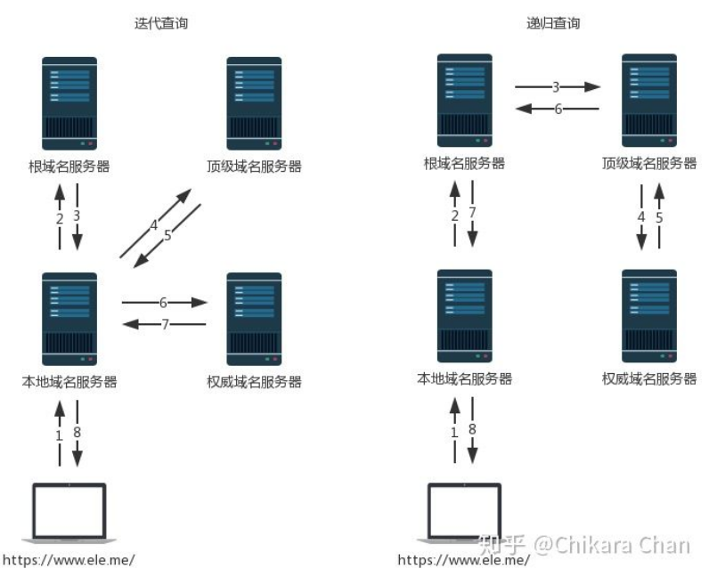
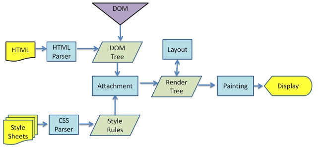
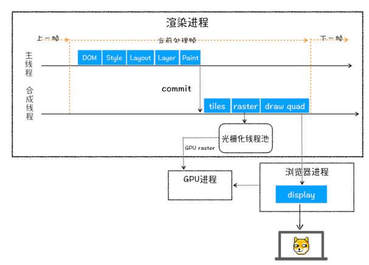

## 浏览器请求网页的过程

1. **用户输入**

   - 根据搜索关键词使用默认搜索引擎合成URL
   - 或者补全URL
   
2. **构建请求**

   - 浏览器进程通过IPC将请求发送到网络进程
   - 网络进程准备发送网络请求

   ```shell
   GET /index.html HTTP 1.1
   ```

3. **查找缓存**

   - 在发起网络请求前，浏览器先在浏览器缓存中查询是否具有请求文件

   > https://juejin.cn/post/6844903763665240072
   >
   > 浏览器缓存：将用户请求过的静态资源存储在电脑本地磁盘，当浏览器再次访问时直接从本地加载
   >
   > **缓存的作用：**
   >
   > - 减少服务器的负担，提升网站性能
   > - 加快客户端加载网页的速度
   > - 减少了冗余的数据传输
   >
   > 
   >
   > **浏览器首次请求资源**
   >
   > 
   >
   > **缓存规则**
   >
   > ——保存在response header中，声明资源的缓存策略，缓存时间等
   >
   > ```shell
   > cache-control: max-age=31536000
   > ```
   >
   > **强缓存**
   >
   > ——如果资源没过期，取缓存；过期则请求服务器
   >
   > 判断过期时间：`cache-control: max-age=31536000`
   >
   > 
   >
   > cache-control取值含义
   >
   > - private：仅浏览器可缓存
   > - public：浏览器和代理服务器都可缓存
   > - no-cache：不进行强缓存，**命中协商缓存**
   > - max-age = xxx : 过期时间，**命中强缓存**
   > - no-store：不进行缓存 （基本不用）
   >
   > 
   >
   > 
   >
   >   
   >
   > **协商缓存**
   >
   > 触发条件：Cache-Control 的值为 **no-cache** 或者 **max-age 过期**
   >
   > 协商缓存的相关规则
   >
   > - etag：每个文件具有修改后值改变
   > - last-modified：文件的修改时间
   >
   > ```shell
   > // response header 第一次响应
   > last-modified: Sun, 20 Dec 2020 23:47:11 GMT
   > etag: "AI5oJngC3uRrqHfH3J2cVzLSc-4j"
   > 
   > // request header 第二次请求
   > If-None-Match: "AI5oJngC3uRrqHfH3J2cVzLSc-4j"
   > If-Modified-Since: Sun, 20 Dec 2020 23:47:11 GMT
   > ```
   >
   > 服务器将请求携带的标识与目前自愿标识进行对比，判断资源是否更改
   >
   > - 未更改：返回304，读取本地缓存
   > - 更改：返回200，携带新的ETag、Last-Modified
   >
   > 
   >
   > 
   >
   >  
   >
   > 

4. **DNS解析：准备IP地址和端口**

   > https://juejin.cn/post/6918894984414363655
   >
   > **本地缓存**：如浏览器DNS缓存，本地hosts文件，本地DNS缓存
   >
   > **DNS服务器缓存**：询问网络提供商的DNS服务器
   >
   > **DNS服务器迭代查询或递归查询**
   >
   > 

5. **HTTPS建立TLS连接**

   - 

6. **建立TCP连接**

   - chrome机制：同一域名只能同时建立6个TCP连接，多余请求将进入TCP队列等待

   > https://juejin.cn/post/6844903950181744653
   >
   > **三次握手**
   >
   > ——用于确认**客户端的发送能力和服务器端的接受能力都是正常的**
   >
   > - 三次握手完成后客户端与服务器才正式开始传送数据
   > - 理想状态下，TCP连接一旦建立，在通信双方中的任何一方主动关闭连接之前，TCP连接都将被一直保持下去
   >
   > 
   >
   > - **第一次握手：**
   >   - 客户端发送syn包 （seq = x）,并进入 SYN_SEND状态，等待服务器确认
   > - **第二次握手：**
   >   - 服务器收到syn包，确定客户的SYN (ack = x + 1)，同时发生自己的syn包 （seq = y）即SYN + ACK包，服务器进入SYN_RECV状态
   >   - 客户端发送能力正常
   > - **第三次握手：**
   >   - 客户端收到服务器SYN+ACK包，向服务器发送确认包ACK (ack = y + 1)，完成三次握手
   >   - 服务端接受能力正常

   

7. **发送HTTP请求，服务器返回响应结果**

   - **重定向**——接受到服务器返回的响应头，若网络进程解析响应头时发现返回状态码是301或302，网络进程将对**Location字段**中的URL地址重新请求
   - **响应数据类型**——`Content-Type`**告知浏览器服务器返回的响应体数据的类型**
     - `application/octet-stream`字节流——下载
     - `text/html`——解析

   

8. **关闭TCP连接**

   > **四次挥手**
   >
   > - **第一次挥手：**客户端发送FIN，表示不再发送数据，但仍可接受数据
   > - **第二次挥手：**服务端收到FIN包，发送ACK包给客户端，表示知道，等待处理剩余工作
   > - **第三次挥手：**服务端发送FIN包，关闭数据传送，表示剩余数据处理完成且不再发送
   > - **第四次挥手：**客户端收到FIN后，发送ACK给服务端

   

9. **提交文档，进入渲染阶段**

   - `提交文档`浏览器进程发出，渲染进程将建立与网络进程传输数据的**管道**
   - 一旦文档提交，渲染进程开始页面解析和子资源加载

   

10. **渲染阶段——构建 DOM 树**

    - 浏览器在接收到html文件后即开始解析和构建DOM树，
      - 由于js代码可能会改变dom的结构，所以为避免重复操作，浏览器会停止dom树构建，先加载并解析js代码
      - 对于css，图片，视频等资源，则交由资源加载器去加载，这个过程是异步的，并不会阻碍dom树的生成

    > `display:none`的元素、注释存在于dom树中
    >
    > js会阻塞dom树的构建从而阻塞其他资源的并发加载，最好将js放在最后加载
    >
    > 对于可异步加载的js片段加上 `async` 或 `defer`

    

11. **渲染阶段——样式计算**

    - 浏览器在碰到`<link>` 和 `<style>` 标签时，会解析css生成**styleSheets**
    - 计算出 DOM 树中每个节点的具体样式

    > js 代码会阻塞cssom的构建
    >
    > cssom的构建与dom树的构建是并行的
    >
    > 减少css的嵌套层级和合理的定义css选择器可以加快解析速度

    

12. **渲染阶段——布局阶段**

    - **创建布局树**——包含了可见的dom节点和节点的样式

      - 不可见的元素如`display：none`不会包含
      - head标签的全部内容

    - **布局计算**

      - 计算每个元素几何坐标位置，保存在布局树中

      

13. **渲染阶段——分层、绘制、分块**

    **分层**：为特定的节点生成专用的图层，并生成**图层树**

    **绘制：**

    - 将图层绘制拆分为绘制指令，按顺序放入待绘制列表
    - 将其提交给渲染引擎的合成线程进行栅格化

    **分块：**

    - 合成线程将图层划分为图块（256 x 256）,靠近视口的图块优先生成位图
    - 渲染进程维护一个栅格化线程池
    - 栅格化可使用GPU进程，进行快速栅格化

    

14. **渲染阶段——合成与显示**

    - 合成线程发送绘制图块命令DrawQuad给浏览器进程
    - 浏览器进程根据 DrawQuad 消息**生成页面**，并**显示**到显示器上

    

