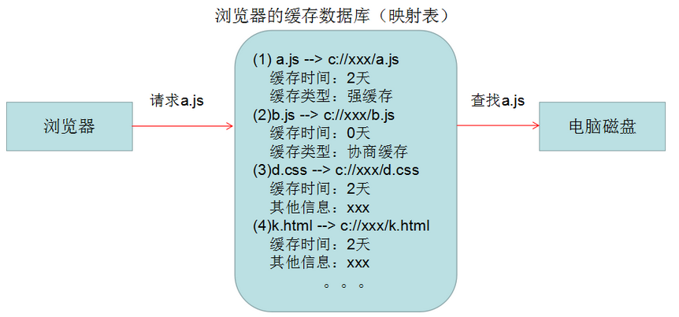
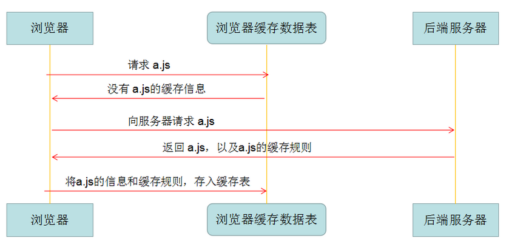
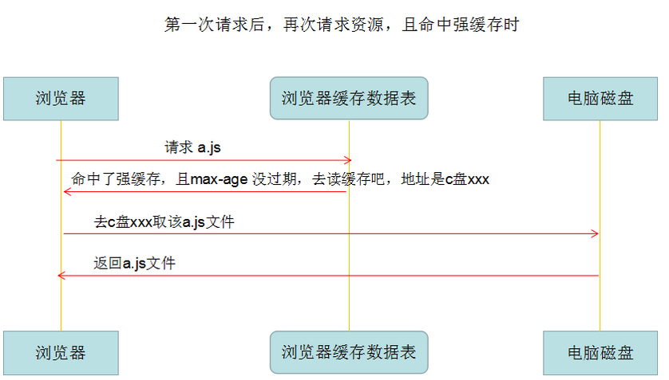
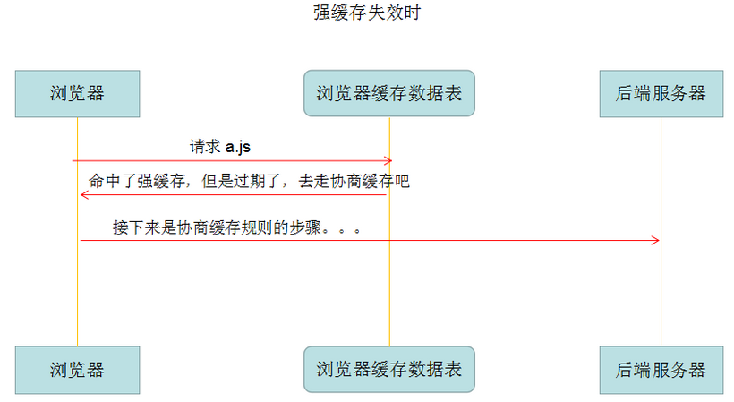
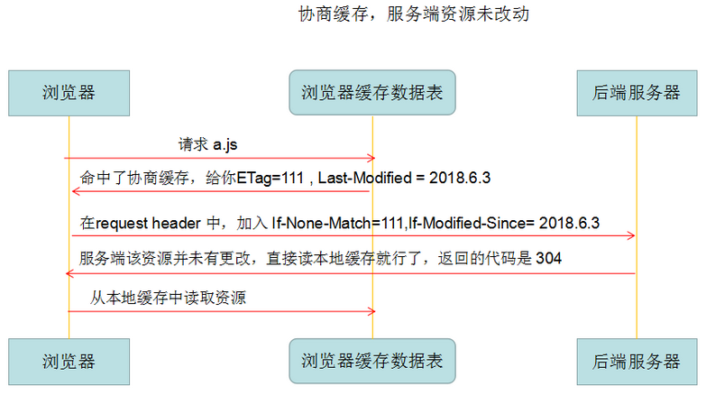
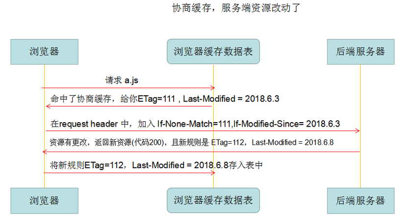
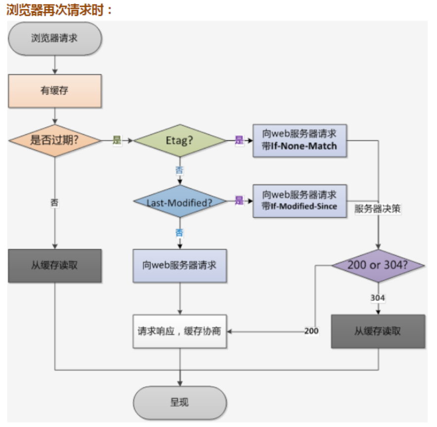
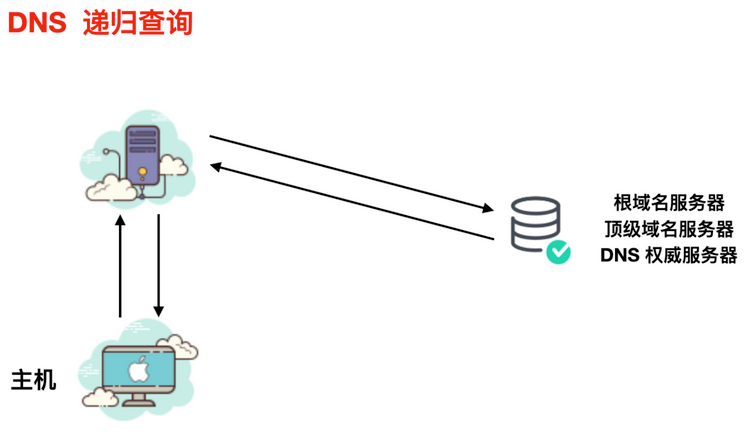
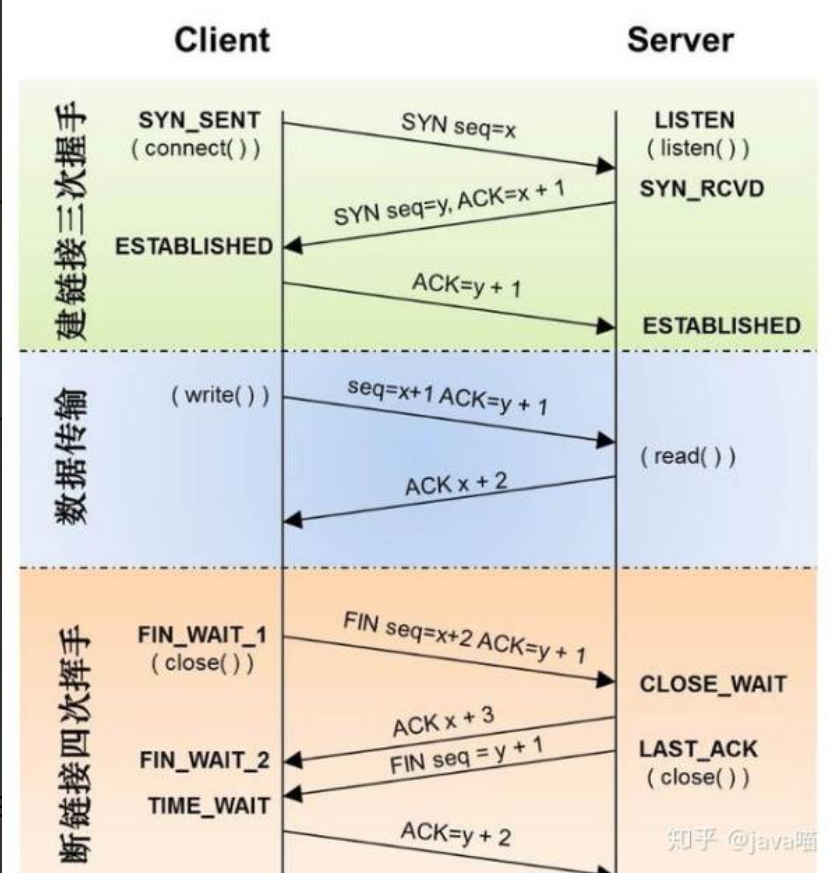

## 浏览器请求网页的过程

1. **构建请求，准备发送网络请求**

   ```shell
   GET /index.html HTTP 1.1
   ```

2. **查找缓存**

   - 在发起网络请求前，浏览器先在浏览器缓存中查询是否具有请求文件

   > https://juejin.cn/post/6844903763665240072
   >
   > 浏览器缓存：将用户请求过的静态资源存储在电脑本地磁盘，当浏览器再次访问时直接从本地加载
   >
   > **缓存的作用：**
   >
   > - 减少服务器的负担，提升网站性能
   > - 加快客户端加载网页的速度
   > - 减少了冗余的数据传输
   >
   > 
   >
   > **浏览器首次请求资源**
   >
   > 
   >
   > **缓存规则**
   >
   > ——保存在response header中，声明资源的缓存策略，缓存时间等
   >
   > ```shell
   > cache-control: max-age=31536000
   > ```
   >
   > **强缓存**
   >
   > ——如果资源没过期，取缓存；过期则请求服务器
   >
   > 判断过期时间：`cache-control: max-age=31536000`
   >
   > 
   >
   > cache-control取值含义
   >
   > - private：仅浏览器可缓存
   > - public：浏览器和代理服务器都可缓存
   > - no-cache：不进行强缓存，**命中协商缓存**
   > - max-age = xxx : 过期时间，**命中强缓存**
   > - no-store：不进行缓存 （基本不用）
   >
   > 
   >
   > 
   >
   >   
   >
   > **协商缓存**
   >
   > 触发条件：Cache-Control 的值为 **no-cache** 或者 **max-age 过期**
   >
   > 协商缓存的相关规则
   >
   > - etag：每个文件具有修改后值改变
   > - last-modified：文件的修改时间
   >
   > ```shell
   > // response header 第一次响应
   > last-modified: Sun, 20 Dec 2020 23:47:11 GMT
   > etag: "AI5oJngC3uRrqHfH3J2cVzLSc-4j"
   > 
   > // request header 第二次请求
   > If-None-Match: "AI5oJngC3uRrqHfH3J2cVzLSc-4j"
   > If-Modified-Since: Sun, 20 Dec 2020 23:47:11 GMT
   > ```
   >
   > 服务器将请求携带的标识与目前自愿标识进行对比，判断资源是否更改
   >
   > - 未更改：返回304，读取本地缓存
   > - 更改：返回200，携带新的ETag、Last-Modified
   >
   > 
   >
   > 
   >
   >  
   >
   > 

3.   **DNS解析：准备IP地址和端口**

   > https://juejin.cn/post/6918894984414363655
   >
   > **本地缓存**：如浏览器DNS缓存，本地hosts文件，本地DNS缓存
   >
   > **DNS服务器缓存**：询问网络提供商的DNS服务器
   >
   > **DNS服务器递归查找**
   >
   > 

4. **建立TCP连接**

   - chrome机制：同一域名只能同时建立6个TCP连接，多余请求将进入TCP队列等待

   > https://juejin.cn/post/6844903950181744653
   >
   > **三次握手**
   >
   > 
   >
   > - **第一次握手：**客户端发送syn包 （syn = x）,并进入 SYN_SEND状态，等待服务器确认
   > - **第二次握手：**服务器收到syn包

