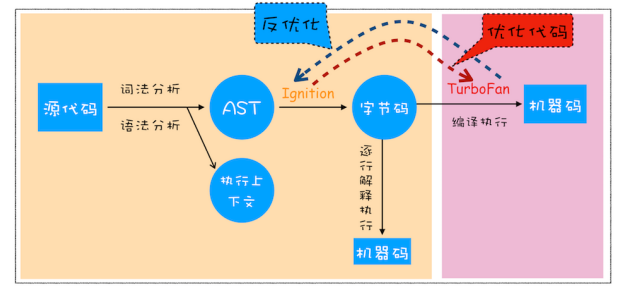

## 栈空间和堆空间

- 静态语言：使用前需要**确认变量的数据类型**
- 动态语言：在运行过程中需要检查数据类型
  - 可以使用同一变量保存不同数据类型
- 弱类型语言：**支持隐式类型转换**
- 强类型语言：**不支持隐式类型转换**


- JavaScript 是一种**弱类型的、动态**的语言


**内存空间**

- JavaScript 执行过程中， 主要有三种类型内存空间：**代码空间、栈空间**和**堆空间**

  - 代码空间主要是存储可执行代码的
  - 栈空间用来存储执行上下文的
  - 堆空间主要用于存放引用类型

  

- 若全部数据存放在栈空间中，**将影响到上下文切换的效率**，进而影响到整个程序的执行效率
- 赋值操作：原始类型赋值会完整复制变量值，而引用类型的赋值是**复制引用地址**
- 闭包的基本类型值没有因为执行上下文切换而销毁，因为编译时JS引擎进行**词法扫描**，由于内部函数引用外部函数的变量判断为闭包，创建 `closure(foo)`的内部对象用于保存闭包值


## 垃圾回收

**垃圾回收策略**

- 内存分配：原始数据类型是存储在栈空间中的，引用类型的数据是存储在堆空间中的
- 内存回收：对垃圾数据进行回收，以释放有限的内存空间
- 手动回收：何时分配内存、何时销毁内存都是由代码控制的，如 C/C++
  - 不再使用的数据未回收将造成**内存泄露**
- 自动回收：产生的垃圾数据是由**垃圾回收器**来释放的，如 JavaScript、Java、Python 等


### 栈-ESP

- **记录当前执行状态的指针**（称为 ESP）
- ESP 指针向下移动，上一个函数执行上下文将标记为无效内存将被新的入栈上下文覆盖
- **JS引擎通过向下移动 ESP 来销毁该函数保存在栈中的执行上下文**


**堆中的数据是如何回收的**

- 回收堆中的垃圾数据，需要用到**垃圾回收器**


### 代际假说和分代收集

- **代际假说**
  - 大部分对象在内存中存在的时间很短
  - 不死的对象会存在更久
- V8 中会把堆分为**新生代和老生代**
  - **新生代**中存放的是**生存时间短**的对象，常只支持 **1～8M** 的容量
  - **老生代**中存放的**生存时间久**的对象，容量**大**很多

**垃圾回收器的工作流程**

- 标记空间中活动对象和非活动对象，活动对象为正在使用的对象
- 回收非活动对象占据的内存
- 内存整理，对内存碎片（大量不连续的内存空间）进行整理


### 堆-副垃圾回收器

- 主要负责新生区的垃圾回收
- 特点：保存对象较小，回收频繁，只支持1-8M的容量，不会产生内存碎片
- **Scavenge 算法**：
  - 将新生区空间对半划分为对象区域与空闲区域
  - 新添加的对象存入对象区域，对象区域快满时，执行垃圾回收
  - 对对象区域中进行**标记-清除**，存活的对象复制到空闲区域
  - 对空闲区域和对象区域进行**角色反转**
- **对象晋升策略：**经过两次垃圾回收依然存活的对象，将会移到老生区


### 堆-主垃圾回收器

- 主要负责老生区的垃圾回收

- 特点：

  - 保存对象：新生区晋升的对象，或者直接分配到老生区的大对象

- **标记 - 清除（Mark-Sweep）**算法

  - 标记过程：递归遍历调用栈，对引用的地址标记为**活动对象**，未到达的地址标记为**垃圾数据**

    

  - 清除过程：清除垃圾数据，造成大量不连续的内存碎片，需要再进行整理

    

- **全停顿**：由于JS运行在主线程上，一旦执行垃圾算法，正在执行的JS脚本将会暂停

- **增量标记（Incremental Marking）算法**：为了降低老生代的垃圾回收而造成的卡顿，V8 将标记过程分为一个个的子标记过程，同时让垃圾回收标记和 JavaScript 应用逻辑交替进行，直到标记阶段完成

  


## 编译器和解释器

- **编译型语言**——在程序执行之前，需要经过编译器的编译过程，并且编译之后会**直接保留二进制文件**，而不需要每次运行时重新编译
- **解释型语言**——**在每次运行时都需要通过解释器对程序进行动态解释和执行**


### 抽象语法树AST

> https://resources.jointjs.com/demos/javascript-ast

- 让编译器或解释器理解源代码的一种数据结构

```js
var a = 42;
```

- 第一阶段：**分词（tokenize）/ 词法分析**

  - 其作用是将一行行的源码拆解成一个个token

    ```
    Tokens:
    Keyword(var)Identifier(a)Punctuator(=)Numeric(42)Punctuator(;)
    ```

- 第二阶段： **解析（parse） / 语法分析**

  - 将上一步生成的 token 数据，根据语法规则转为 AST
  - 源码存在错误，抛出 “语法错误”


### V8 如何执行 JavaScript 代码



1. **生成抽象语法树AST和执行上下文**

   - 执行上下文：用于保存执行过程的环境信息(变量环境、词法环境、outer、this)
   - 抽象语法树：让编译器或解释器理解源代码的一种数据结构

2. **生成字节码**

   - 使用解释器根据AST生成字节码并解释执行
   - **字节码就是介于 AST 和机器码之间的一种代码，需要解释器将其转换为机器码才能执行**
   - 没有直接生成机器码，因为内存占用问题  机器码体积更大

   

3.  **执行代码**

   - 第一次执行的字节码，**解释器 Ignition**逐条解释执行
   - 发现多次执行的热点代码，使用**编译器TurboFan**，将该段代码转换为更高效的机器码

   

### 即时编译（JIT）

- 解释器 Ignition 在解释执行字节码的同时，收集代码信息，
- 当解释器发现某一部分代码变热之后，TurboFan 编译器便把热点的字节码转换为机器码，并把转换后的机器码保存起来，以备下次使用


### JavaScript 的性能优化

- 提升单次脚本的执行速度，避免 JavaScript 的长任务霸占主线程，使得页面快速响应交互；
- 避免大的内联脚本，因为在解析 HTML 的过程中，解析和编译也会占用主线程
- 减少 JavaScript 文件的容量，因为更小的文件会提升下载速度，并且占用更低的内存