## 消息队列和事件循环

- 每个渲染进程都有一个主线程，主线程任务繁忙如处理DOM、计算样式、处理布局、处理JavaScript任务以及各种输入事件
- 渲染进程需要**消息队列和事件循环系统**有序调度任务


在运行过程中能够接受并处理新任务

- 引入**循环语句和事件系统**

接收其他线程发送的任务

- 添加一个**消息队列**
- IO 线程中产生的新任务添加进消息队列尾部
- 渲染主线程会循环地从消息队列头部中读取任务，执行任务

接收其他进程发送的任务

- 其他进程通过 IPC 把消息发送给渲染进程的 IO线程
- IO线程接受其他进程的消息，并将消息封装成任务添加到消息队列中

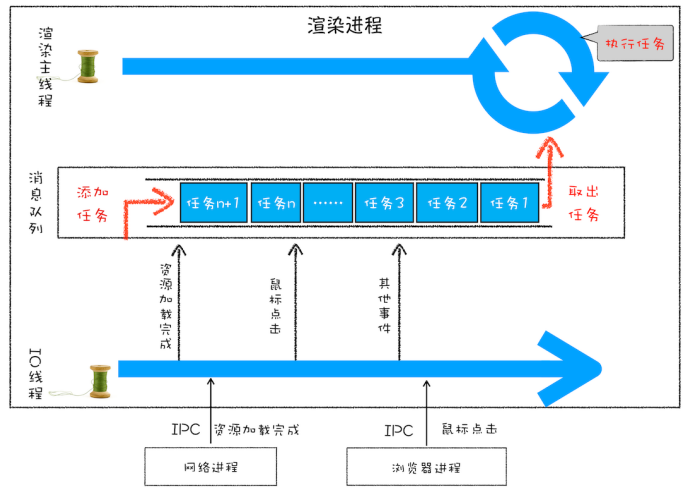

### 消息队列中的任务类型

- 微任务、文件读写、websocket、JavaScript 定时器、页面相关的事件等等

  

### 安全退出

- 在渲染主线程每次执行完一个任务时，都会判断是否具有主线程设置的**退出标志变量**
- 判断成功，中断当前所有任务，退出线程


### 页面使用单线程的缺点

> **页面线程所有执行的任务都来自于消息队列**，而消息队列具有先进先出的属性


**如何处理高优先级的任务**

- 如监测DOM节点变化

- 采用**同步通知**：DOM变化频繁如果直接执行，影响消息队列**当前任务的执行效率**

- 采用**异步通知**：添加到消息队列尾部，影响DOM**监控的实时性**

- **微任务**

  - 将消息队列的任务称为**宏任务**，每个宏任务**包含一个微任务队列**
  - 在执行宏任务过程中，将DOM变化**添加到微任务队列**中，宏任务继续执行——解决当前任务执行效率问题
  - 当前宏任务主要功能执行完成，依次执行当前宏任务中微任务——解决实时性问题

  

**如何解决单个任务执行时间过久**

- JavaScript 通过回调功能来处理执行过长的问题，即让要执行的JavaScript 任务滞后执行


## WebAPI—setTimeout

### 实现 setTimeout

> 为保证setTimeout中回调函数能够**在指定时间内执行**，不能将定时器回调函数直接添加到消息队列中

- 在chrome中，维护另一个消息队列存放需要延迟执行的任务，包含定时器和内部延时任务
- 创建定时器时，渲染进程**将该定时器回调任务添加到延时队列中**

- **如何触发延时队列**——在消息队列中一个任务执行完时，执行`ProcessDelayTask` 函数，若延时队列有到期任务，依次执行到期任务，在进行下一个循环过程


### 使用 setTimeout 注意事项

- 当前任务执行时间，将影响延迟到期定时器任务的执行
-  setTimeout 存在嵌套调用，系统设置最短时间间隔为 4 毫秒
- 未激活的页面，setTimeout 执行最小间隔是 1000 毫秒
- 延时执行时间有最大值
- 使用 setTimeout 设置的回调函数中的 this 不符合直觉


## WebAPI—XMLHttpRequest

- 回调函数：将一个函数作为参数传递给另外一个函数，作为参数的函数就是回调函数
- **同步回调**——回调函数 callback 是在主函数返回之前执行的
- **异步回调**——回调函数 callback 是在主函数返回之后执行的
- 循环系统执行任务时，会为该任务维护一个**系统调用栈**
  - 同步回调就是在当前主函数的上下文中执行回调函数
  - 异步回调是指回调函数在主函数之外执行
    - 异步函数做成一个任务，添加到信息队列尾部
    - 异步函数添加到微任务队列中，在当前任务的末尾处执行微任务

### XMLHttpRequest 运作机制

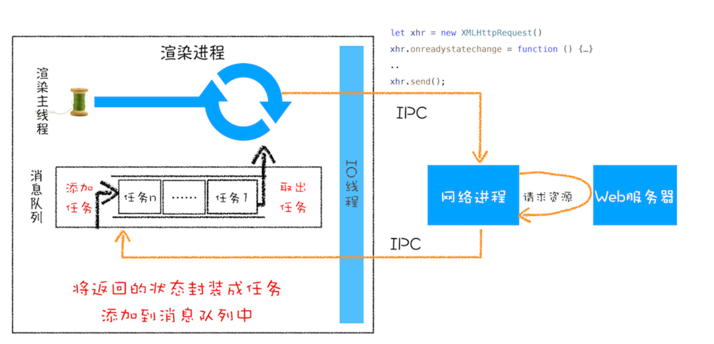

### **XMLHttpRequest** 注意事项

-  **跨域问题**

-  **HTTPS** **混合内容问题**

  -  HTTPS 页面中包含了不符合 HTTPS 安全要求的内容，比如包含了 HTTP 资源，通过 HTTP 加载的图像等

  - 通过 HTML 文件加载的混合资源，可正常显示

    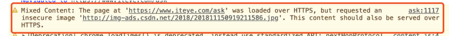

  - 使用 XMLHttpRequest 请求的混合资源，阻止

    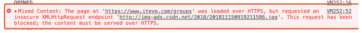

  

## 宏任务和微任务

### 宏任务

- 宏任务
  - 渲染事件（如解析 DOM、计算布局、绘制）
  - 用户交互事件（如鼠标点击、滚动页面、放大缩小等）
  - JavaScript 脚本执行事件
  - 网络请求完成、文件读写完成等IO事件

- 渲染主线程采用for循环，从消息队列中取出宏任务并执行

- 宏任务为**粗时间颗粒度**，难以满足时间精度较高的任务，比如监听DOM变化

- 在消息队列添加时间为系统操作不能控制，而在宏任务间可能插入系统级任务，导致执行时间间隔不能控制

  

### 微任务

- **微任务**：需要异步执行的函数，执行时机在主函数执行结束后，当前宏任务结束之前
- 在创建全局执行上下文同时将在其内部创建**微任务队列**，每个宏任务都关联一个微任务队列
- **微任务队列是放在全局执行上下文中的**

**微任务的产生**

1. 使用 **MutationObserver**监听某个DOM节点
   - 通过JS代码修改该节点时，将产生DOM变化记录的微任务
2. 使用Promise，当调用**Promise.resolve()** 或 **Promise.reject()**产生微任务

**微任务何时执行**

- **检查点**：在当前宏任务中JavaScript快执行完时，JS引擎准备退出全局上下文并清空调用栈时，JavaScript引擎会检查全局上下文的微任务，并按照顺序执行队列的微任务
- 在执行微任务过程中产生的新的微任务并不会推迟到下个宏任务中执行，而是在当前的宏任务中继续执行
- 微任务的执行时长会影响到当前宏任务的时长


```js
function bar() {
  console.log('bar');
  Promise.resolve().then((str) => console.log('micro-bar'));
  setTimeout((str) => console.log('macro-bar'), 0);
}
function foo() {
  console.log('foo');
  Promise.resolve().then((str) => console.log('micro-foo')); //微任务
  setTimeout((str) => console.log('macro-foo'), 0); //宏任务 延时队列
  bar();
}

foo();

console.log('global');
Promise.resolve().then((str) => console.log('micro-global'));
setTimeout((str) => console.log('macro-global'), 0);
// foo bar global micro-foo micro-bar micro-global macro-foo macro-bar macro-global
```

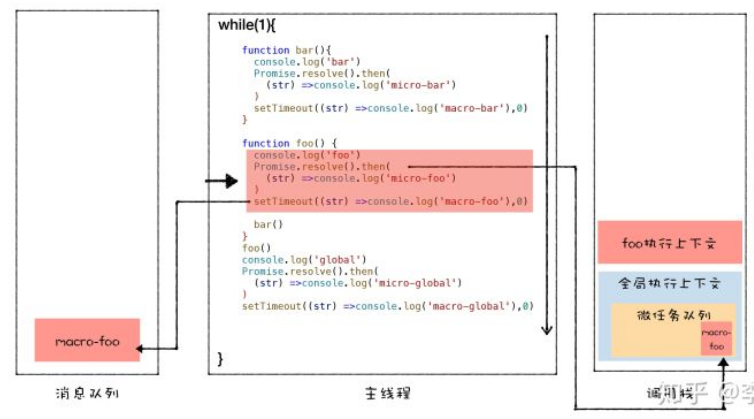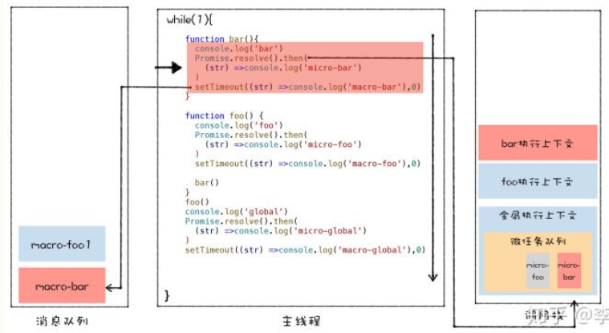

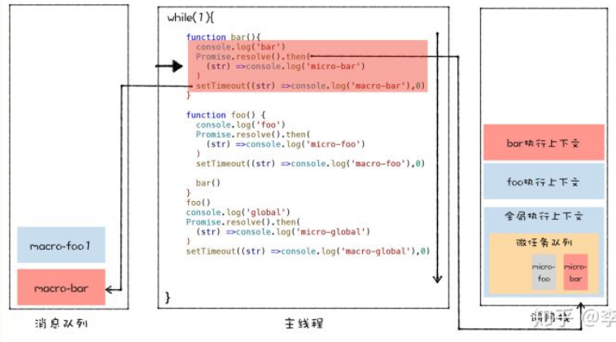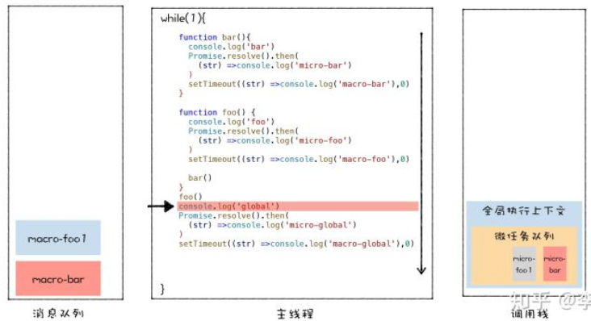

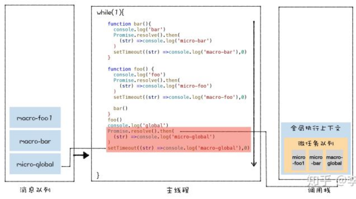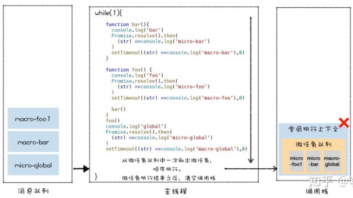

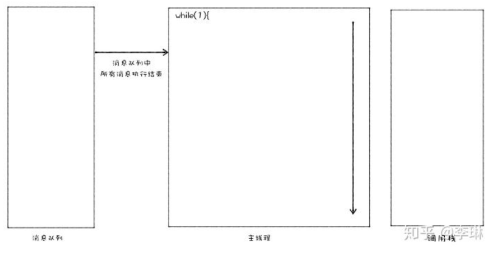


**监听** **DOM** **变化方法演变**

- MutationObserver 将响应函数改成异步调用，可以不用在每次 DOM 变化都触发

  异步调用，而是等多次 DOM 变化后，**一次触发异步调用**

-  MutationObserver 采用了“**异步 + 微任务**”的策略

  - 通过**异步**操作解决了同步操作的**性能问题**
  - 通过**微任务**解决了**实时性的问题**


##  Promise

**异步编程问题**

- 由于JS单线程执行，在渲染主线程执行耗时任务时如下载网络文件，获取设备信息等，将这些**耗时任务放在页面主线程之外的进程或线程执行，避免耗时任务霸占主线程**

- 将处理结果再添加到消息队列排队等待事件循环系统处理

  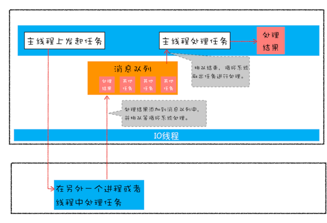

**封装异步代码**

- 重点关注：**输入内容（请求信息）和输出内容（回复信息）**

  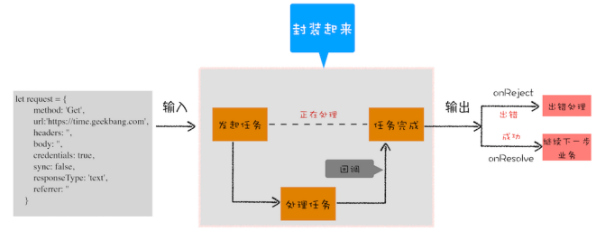

- 问题

  - **嵌套调用**：下个任务依赖上个任务请求结果，并在上个任务的回调函数内部执行新的业务逻辑
  - **任务不确定性**：对每次任务都需进行错误处理

  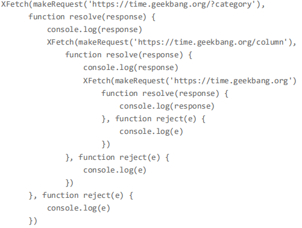


### Promise：消灭嵌套调用和多次错误处理

- **Promise 实现回调函数的延时绑定**
  - 通过promise.then()设置回调延时绑定
  - 执行 resolve 函数，会触发 promise.then 设置的回调函数 onResolve

- **需要将回调函数 onResolve 的返回值穿透到最外层**

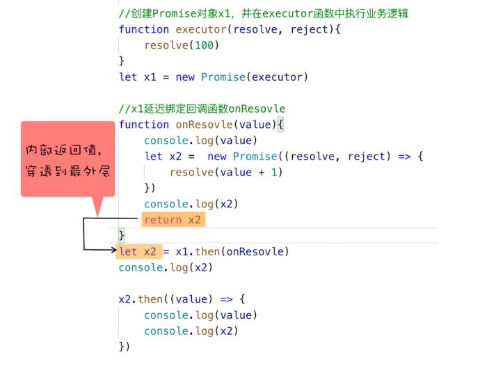

-  **Promise 对象的错误具有“冒泡”性质，会一直向后传递，直到被 onReject 函数处理或 catch 语句捕获为止**


### Promise 与微任务

-  Promise 中为什么要引入微任务？
- Promise 中是如何实现回调函数返回值穿透的？
- Promise 出错后，是怎么通过“冒泡”传递给最后那个捕获异常的函数？