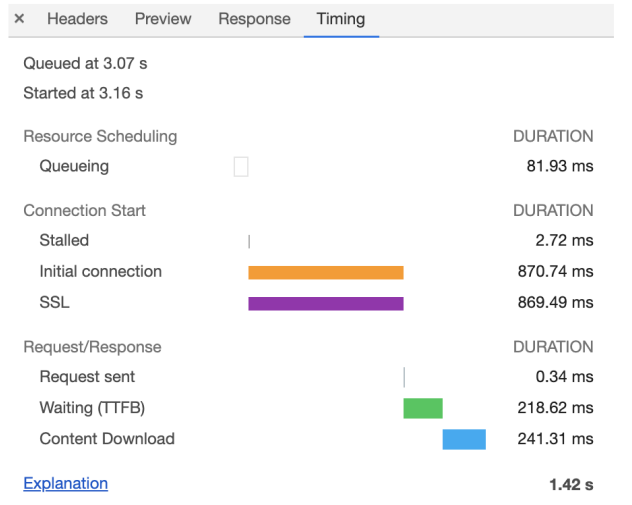

##  Chrome开发者工具

DevTools 是一组**网页制作和调试**的工具，内嵌于 Chrome 浏览器中

- 提供通过界面访问或者编辑 DOM 和 CSSOM 的能力
- 提供强大的调试功能和查看性能指标的能力


### 网络面板


**控制器**

 **过滤器**

**抓图信息**：用来分析用户等待页面加载时间内所看到的内容，分析用户实际的体验情况

**时间线**：主要用来展示 HTTP、HTTPS、WebSocket 加载的状态和时间

**详细列表**：详细记录了每个资源从发起请求到完成请求中间所有过程的状态，以及最终请求完成的数据信息

**下载信息概要**:

- DOMContentLoaded：页面已经完成DOM构建，意味着HTML文件，JavaScript文件、CSS文件下载完成
- Load事件：浏览器已经加载了所有的资源（图像、样式表等）


### 单个资源的时间线




- **Queuing **：浏览器发起的请求需要排队等待
  - 页面资源优先级，html、css、js资源大于图片视频音频等资源
  - 浏览器为每个域名最多维护6个TCP连接
  - 等待网络进程为已下载资源分配磁盘空间
- **Stalled**：发起连接之前，导致连接过程被推迟的其他原因，表示停滞
- **Initial connection**：和服务器建立连接的阶段，包括建立TCP连接的时间
- **SSL **：使用 HTTPS 协议额外的SSL握手时间，用来协商加密信息
- **Request sent** ：和服务器连接建立完成，网络进程准备请求数据
- **Waiting (TTFB)**: 等待接收服务器第一个字节的数据,**第一字节时间**
  -  TTFB 是反映服务端响应速度的重要指标
- **Content Download** ：第一字节时间到接收到全部响应数据所用的时间

### 优化时间线上耗时项

排队（Queuing）时间过久

- 由浏览器为每个域名最多维护 6 个连接导致的
- **域名分片**：让 1 个站点下面的资源放在多个域名下面
- **站点升级到 HTTP2**：没有每个域名最多维护 6 个 TCP 连接的限制

 第一字节时间（TTFB）时间过久

- 服务器生成页面数据的时间过久
- 网络的原因
- 发送请求头时带上了多余的用户信息

 Content Download 时间过久

- 字节数太多的原因导致的。需要减少文件大小，比如压缩、去掉源码中不必要的注释等方法


## DOM树

### DOM 树如何生成

- 在渲染引擎内部的 HTML 解析器（HTMLParser）模块，负责将 HTML 字节流转换为 DOM 结构

- **网络进程加载多少数据，HTML 解析器便解析多少数据**

  - 网络进程根据响应头中的 content-type字段来判断文件的类型
  -  HTML 类型的文件，为该请求选择或者创建一个渲染进程
  - **网络进程和渲染进程之间会建立一个共享数据的管道**
  - 渲染进程的 HTML 解析器，动态接收字节流，并将其解析为 DOM

  

### 字节流转换为 DOM


- 通过分词器将字节流转换为 Token

  

- **将 Token 解析为 DOM 节点，并将DOM 节点添加到 DOM 树中**

  - HTML 解析器维护一个**Token 栈结构**，用来计算节点之间的父子关系

    

### JavaScript 是如何影响 DOM 生成

- 解析到<script>标签时，渲染引擎判断为脚本，HTML 解析器会暂停 DOM 的解析
- JavaScript 引擎介入，并执行 script 标签中的脚本
- 脚本执行完成之后，HTML 解析器恢复解析过程，继续解析后续的内容

**JavaScript 文件的下载过程会阻塞DOM 解析**

- **预解析操作**——当渲染引擎收到字节流之后，开启一个预解析线程，用来分析 HTML 文件中包含的 JavaScript、CSS 等相关文件，解析到相关文件之后，预解析线程会提前下载这些文件
- 使用 CDN 来加速 JavaScript 文件的加载，压缩 JavaScript 文件的体积
- JavaScript 文件中没有操作 DOM 相关代码，可以将该 JavaScript 脚本设置为**异步加载**
  - 通过 async 或 defer 来标记代码
  - 使用 async 标志的脚本文件一旦加载完成，会立即执行
  - 使用 defer 标记的脚本文件，需要在 DOMContentLoaded 事件之后执行
- 样式文件会阻塞JavaScript 的执行
  - 渲染引擎在遇到 JavaScript 脚本时，不管脚本是否操纵 CSSOM，都会执行 CSS 文件下载，解析操作，再执行 JavaScript 脚本

- CSS不阻塞dom的生成，CSS不阻塞js的加载，但是会阻塞js的执行

  

## 渲染流水线：CSS如何影响首次加载时的白屏时间


- 渲染进程或浏览器进程发起请求到网络进程中执行
- 网络进程接收返回的HTML数据后发送给渲染进程
- 渲染进程解析HTML数据
  - **开启预解析线程**，遇到js文件或css文件进行提前下载
  - 利用HTML解析器构建DOM
- 构建DOM过程被 javascript 代码执行打断，阻塞
  -  JavaScript 代码可能修改当前状态DOM
- 执行 JavaScript 脚本前需要构建CSSOM （外部CSS、style标签的CSS）
  - JavaScript 代码具有修改CSSOM的能力
- 等待DOM和CSSOM构建完成，合成布局树
  - 过滤不需要显示的标签，如 `display:none`、head标签、script标签等
  - **样式计算**
  - **计算布局**：每个元素对应的几何位置


### 影响页面展示的因素以及优化策略

- **解析白屏**——提交数据后，渲染进程创建一个空白页面，并等待CSS文件和JavaScript 文件的加载完成生成CSSOM和DOM合成布局树等一系列步骤准备首次渲染
- 步骤：解析HTML-下载CSS-下载JavaScript -生成CSSOM-执行JavaScript -生成DOM-生成布局树-绘制页面

通常情况下的瓶颈主要体现在**下载 CSS 文件、下载 JavaScript 文件和执行 JavaScript**

- 通过内联 JavaScript、内联 CSS 来移除这两种类型的文件下载
- 尽量减少文件大小，比如通过 webpack 等工具移除一些不必要的注释，并压缩 JavaScript 文件
- 不需要在解析 HTML 阶段使用的 JavaScript 标记上 sync 或者 defer
- 通过媒体查询属性，将其拆分为多个不同用途的 CSS 文件


## 分层和合成机制：为什么CSS动画比JavaScript高效


**显示器是如何显示图像的**

- 显示器读取显卡**前缓存区**的图片并显示，如显示器刷新频率为60HZ,则每秒读取60次图像
- 显卡合成新的图像并保存在**后缓存区**，合成图像写入完后，前后缓存区互换
- 在滚动或者缩放操作时，渲染引擎会通过渲染流水线生成新的图片，并发送到显卡的后缓冲区
  - 渲染引擎需要每秒更新 60 张图片到显卡的后缓冲区


### 如何生成一帧图像

- 任意一帧的生成方式，有**重排、重绘和合成**三种方式；渲染路径是不同的，**通常渲染路径越长，生成图像花费的时间就越多**
  - **重排**——要重新根据 CSSOM 和 DOM 来计算布局树
  - **重绘**——不需重新布局，但需重新计算绘制信息，并触发绘制的一系列后续操作
  - **合成**——不需要重新布局和绘制，使用GPU合成效率很高

### 分层和合成

- **为了提升每帧的渲染效率，Chrome 引入了分层和合成的机制**
- 将素材分解为多个图层的操作就称为**分层**
- 将多个图层合并到一起的操作就称为**合成**


- 分层体现在布局树后，渲染引擎根据布局树的特点将其转换为**层树 (Layer Tree)**
- 层树的每个节点都对应一个图层，绘制阶段依赖于层树的节点
- **绘制阶段**——将绘制指令合成一个列表
- **光栅化阶段**——按照绘制列表的指令生成图片，每个图层对应一张图片
- 合成线程将图层图片合成为一张发送到后缓存区
- **合成操作是在合成线程上完成的，意味着在执行合成操作时，是不会影响到主线程执行的**


### 分块

- 合成线程会将每个图层分割为大小固定的图块，然后优先绘制靠近视口的图块
- **纹理上传**——从计算机内存上传到 GPU 内存的操作会比较慢
- **在首次合成图块的时候使用一个低分辨率的图片**


### 利用分层技术优化代码

- 使用 will-change 来告诉渲染引擎对该元素做一些特效变换

  ```css
  .box {
      will-change: transform, opacity
  }
  ```

  

  


