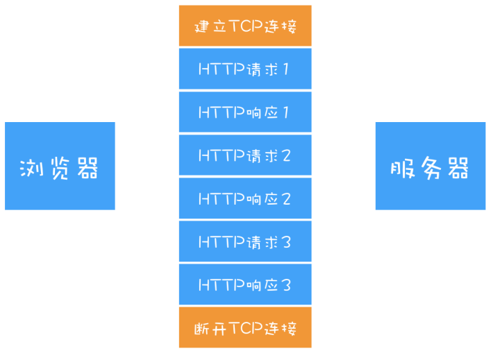

## HTTP/1：HTTP性能优化

### 超文本传输协议 HTTP/0.9

- 基于请求响应模式，客户端发出请求，服务端返回数据
  - 客户端根据IP地址，端口和服务器建立TCP连接
- 客户端：发送GET请求行信息获取html文件
- 服务端：将数据以ASCII字符


### 浏览器推动的 HTTP/1.0

- **支持多种类型文件的下载**，如JavaScript、图片、视频等
- 引入**请求头、响应头信息**，以key-value形式保存，发送和响应时携带


**支持多种文件类型**

```
请求头
accept: text/html; //文件类型
accept-encoding: gzip, deflate, br; //文件压缩方式
accept-Charset: ISO-8859-1, utf-8; //文件编码方式
accept-language: zh-CN, zh; //文件语言版本
```

```
响应头
content-encoding: br;
content-type: text/html, charset=utf-8;
```

**请求头、响应头信息**

- **状态码**——响应行的方式来通知浏览器，服务器最终处理情况
- **Cache 机制**——缓存已下载数据，减轻服务器压力
- **用户代理**——统计客户端的基础数据


### 缝缝补补的 HTTP/1.1

**改进持久连接**

- HTTP/1.0 **短连接** ——每进行一次 HTTP 通信，都需要建立 TCP 连接、传输 HTTP 数据和断开TCP 连接

  

- HTTP/1.1 **持久连接** 

  - 可在一个TCP连接上传输多个HTTP请求，只要浏览器或服务器没有明确断开
  - 有效减少TCP建立和断开连接的次数，减轻服务器负担，减少HTTP请求时长
  -  浏览器为每个域名最多同时维护 6 个 TCP 持久连接



**不成熟的 HTTP 管线化**

> 持久连接需要等待前面的请求返回之后，才能进行下一次请求

- **队头阻塞** ——TCP通道中某个请求没能及时返回，将阻塞该通道内后面的所有请求
- **管线化**——将多个HTTP请求整批提交给服务器，服务器按照请求顺序响应请求


 **提供虚拟主机的支持**

- **Host 字段**——用来表示当前的域名地址，服务器根据不同的 Host 值做不同的处理

 **支持动态生成的内容**

- HTTP/ 1.0 ——响应头设置完整数据大小 `Content-Length: 901`

- HTTP/ 1.1 ——**Chunk transfer 机制**

**客户端 Cookie、安全机制**

**使用 CDN 的实现域名分片机制**

- 引入 CDN，并同时为每个域名维护 6 个连接


## HTTP/2：如何提升网络速度

**HTTP/1.1 的主要问题**

> 带宽是指每秒最大能发送或者接收的字节数

- 对带宽的利用率不理想
  - **TCP 的慢启动**——TCP建立成功后，TCP协议传输数据开始阶段速度较慢
  - 同时开启多条TCP连接，将会竞争固定带宽
  - 队头阻塞使得数据不能并行请求，不利于浏览器优化


### HTTP/2 的多路复用

- 