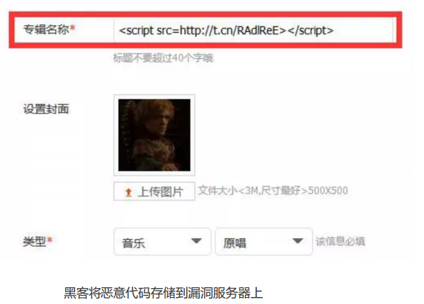

若浏览器不进行安全限制，网站将会加载并执行其他站点的资源，甚至执行脚本文件

- 修改其他站点的DOM、CSSOM等信息
- 在其他站点插入JavaScript脚本
- 劫持用户登录的用户名和密码
- 读取其他站点的Cookie、indexDB等数据
- 截取信息上传到自己服务器

浏览器安全分为——**Web 页面安全、浏览器网络安全**和**浏览器系统安全**


## Web 页面安全

### 同源策略Same-origin policy

同源：URL的协议、域名、端口都相同

浏览器默认两个同源网站间可以相互访问资源和操作DOM，不同源间禁止相互访问资源和操作DOM

- **DOM交互**——限制来自不同源的脚本对当前DOM对象的读取
- **页面数据**——限制来自不同源的站点读取当前站点的Cookie、IndexDB、localStorage等数据
- **网络通信**——限制通过 XMLHttpRequest 等方式将站点的数据发送给不同源的站点


### 内容安全策略CSP

**核心思想**

让服务器决定浏览器能够加载哪些资源，能否执行内联JavaScript代码

用于检测并削弱 XSS跨站脚本和数据注入攻击

**配置与使用**

- 添加 `Content-Security-Policy`  **HTTP头部**到一个页面，并配置相应的值，以控制用户代理（浏览器等）可以为该页面获取哪些资源

  - 允许内容来自信任的域名及其子域名

  ```shell
  Content-Security-Policy: default-src 'self' *.trusted.com
  ```

- `<meta>` 元素配置CSP

  ```html
  <meta http-equiv="Content-Security-Policy" content="default-src 'self'; img-src https://*; child-src 'none';">
  ```

  

### 跨域资源共享（CORS）

默认情况下，不同源的页面不能通过 XMLHttpRequest 或者 Fetch 来相互请求资源

**跨域资源共享（CORS）**——让受信任的站点可以进行跨域访问控制，从而使跨域数据传输安全进行


### 跨文档消息机制

通过 `window.postMessage` 的 JavaScript 接口来和不同源的 DOM 进行通信

- 广义上，一颗窗口可获取另一个窗口的引用 `targetWindow = window.opener`
- 在当前窗口上调用 `targetWindow.postMessage()` 方法分发一个  [`MessageEvent`](https://developer.mozilla.org/zh-CN/docs/Web/API/MessageEvent) 消息
- 收消息的窗口可以根据需要自由处理此事件


### 便利 — 安全问题

| 便利               | 问题            | 策略             |
| ------------------ | --------------- | ---------------- |
| 页面引用第三方资源 | XSS(跨站脚本)等 | 同源策略、CSP    |
| XHR/Fecth跨域请求  | 同上            | 跨域资源共享CORS |
| 不同源DOM操作      | 同上            | 跨文档消息机制   |


### 跨站脚本攻击（XSS）

XSS攻击——黑客往HTML文件或DOM中**注入恶意脚本**，从而在用户浏览页面时利用注入的恶意脚本对用户实施攻击

- **窃取Cookie信息**——document.cookie + xhr + CORS
- **监听用户行为**——addEventListener
- **修改DOM**——伪造登录页面
- **页面浮窗广告**


**存储型XSS攻击**

——黑客利用站点漏洞将恶意代码提交到网站数据库中，用户请求包含恶意代码的页面，恶意脚本将用户Cookie等信息上传到黑客的服务器



- 用户打开该专辑时，运行该脚本


**反射型XSS攻击**

——恶意脚本属于用户发送给网页请求的一部分，随后网页将恶意脚本返回给用户

- 反射型XSS攻击的脚本不会存储在服务器中

```
http://localhost:3000/?xss=<script>alert('进行xss攻击')</script>
```


**基于 DOM 的 XSS 攻击**

——基于 DOM 的 XSS 攻击是不牵涉到页面 Web 服务器，黑客通过各种手段将恶意脚本注入用户的页面中

- **网络劫持**在页面传输过程中修改 HTML 页面的内容
  - WIFI路由器劫持
  - 本地恶意软件劫持


#### 阻止 XSS 攻击

- 服务器对输入脚本进行过滤或转码
- 充分利用 CSP
  - 限制加载其他域名的资源文件
  - 禁止向第三方域名提交数据
  - 禁止执行内联脚本和未授权脚本
- 使用HttpOnly属性
  - 服务器将某些 Cookie 设置为 HttpOnly 标志，只能**使用在http请求过程**


###  CSRF攻击

