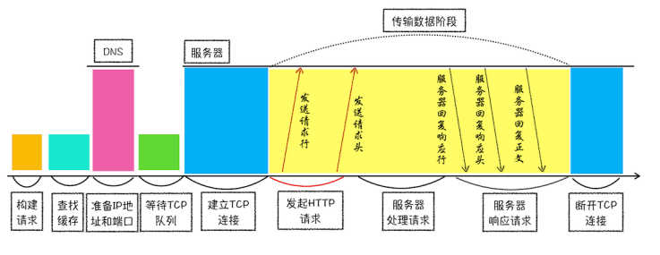
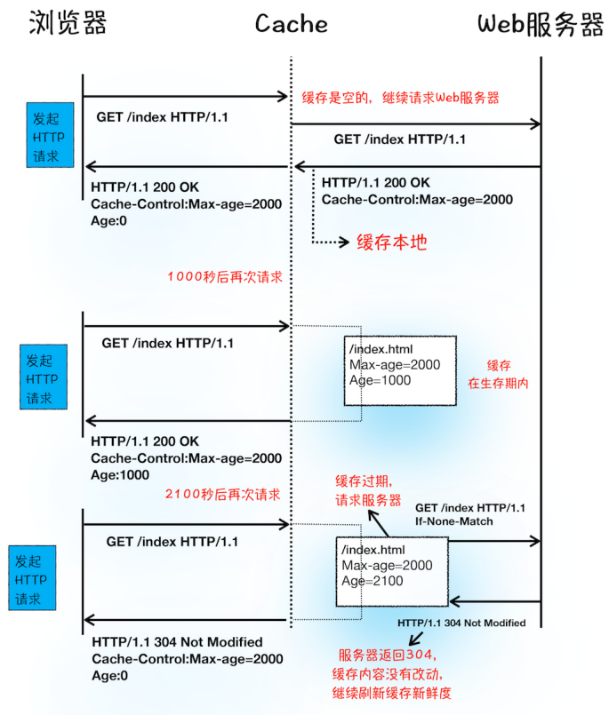

## TCP协议

- HTTP协议 与 WebSocket 协议都是基于TCP/IP的

- 数据是通过数据包来传输的，如果数据很大将会被拆分为很多小数据包传输

- **网际协议**（IP）

  - 将数据包传输到正确的地址
  - 数据包在传输前会被加上IP头用于正确寻址（**网络层**）
  - IP头包含：IP版本、源IP地址、目标IP地址、生存时间

- **用户数据包协议**（UDP）

  - 基于IP协议，通过**端口号**将指定的数据包发送给指定的程序
  - 在**传输层**包装UDP头，包含目标端口号等信息
  - UDP 可以校验数据是否正确，但对于发送错误的数据包**不提供重发机制**
  - UDP 在发送之后，不知道数据包是否抵达，也不知道如何组装大文件
  - **不能保证数据可靠性，但传输速度非常快**，可用于在线视频等场景

  > IP通过 IP 地址信息把数据包发送给指定的电脑
  >
  > UDP通过端口号把数据包分发给正确的程序

- **传输控制协议** (TCP )

  - **面向连接的、可靠的、基于字节流的传输层通信协议**
  - 对于要求数据传输可靠的场景，使用TCP协议
  - **重传机制**：引入数据包排序机制，用来保证把乱序的数据包组合成一个完整的文件
  - **数据包排序机制**：用来保证把乱序的数据包组合成一个完整的文件
  - TCP 头：包含端口号等，以及用于排序的序列号

- **TCP 连接过程**

  -  TCP 连接的生命周期包括**建立连接、传输数据、断开连接**

  

  - 建立连接：通过三次握手建立TCP连接
  - 传输数据：
    - 接收端需要对每个数据包进行确认，发送确认数据包给发送端
    - 在规定时间未收到确认反馈，触发重发机制
    - 数据包到达接收端，按照TCP头序号排序
  - 断开连接：四次挥手


##  HTTP请求流程



- **HTTP协议允许浏览器向服务端获取资源**
- HTTP协议建立在连接的基础上
- HTTP内容通过TCP的传输数据阶段实现的

**浏览器发起HTTP请求流程**

- **构建请求**：输入URL地址，浏览器构建请求行信息
- **查找缓存**
  - 已缓存：拦截请求，返回资源副本
    - 缓解服务器压力，提升响应性能
  - 未缓存：进入网络请求过程
- **准备IP地址和端口**
  - 浏览器请求DNS返回域名对应IP 或浏览器**DNS缓存**服务
  - HTTP协议默认80端口
- **等待TCP连接**
  - 同一个域名同时最多只能建立 6 个 TCP 连接
- **建立TCP连接**：三次握手
- **发送HTTP请求**
  - 请求行：请求方法，请求URI，HTTP版本
  - GET：请求资源
  - POST：发送数据，保存在请求体
  - 请求头：浏览器基本信息、请求域名信息、cookie等


**服务器处理HTTP请求流程**

- **返回请求**
  - 响应行：HTTP版本、状态码
  - 响应头：返回数据时间，数据类型、需保存的Cookie等
  - 响应体：返回数据内容主体
- **断开连接**
  - 服务器返回请求数据，关闭TCP连接
  - `Connection:Keep-Alive`保持TCP长连接
  - 长连接提升资源加载速度，如内嵌图片来源于同一服务器


**浏览器缓存**

- 浏览器具有DNS缓存和页面资源缓存

  

- 浏览器通过响应头中的 **Cache-Control 字段**来设置是否缓存该资源

- 缓存未过期

  ```
  Cache-Control:Max-age=2000
  age:1000
  ```

- 缓存过期

  ```
  If-None-Match:"4f80f-13c-3a1xb12a"
  ```

  - 服务器收到请求头后，会根据 **If-None-Match字段** 判断请求的资源是否有更新

    

**登录状态保持**

- 用户提交登录信息，发送请求

- 服务端验证登录信息后，使用 **`Set-Cookie`字段**将token发送给浏览器

  ```
  Set-Cookie:UID = 3431uad
  ```

- 浏览器解析响应头保存cookie

- 用户再次访问该站点内容，携带cookie中信息

  ```
  Cookie: UID=3431uad
  ```

- 服务端验证tokon，判断是否已登录，返回页面数据

