## 变量提升

- 在定义前使用变量，该变量的值为 `undefined`
- 在定义前使用函数，该函数正确执行

**变量提升（Hoisting）**

- 在JS代码执行过程中，JS引擎**将变量和函数的声明部分提升到代码开头部分**，变量提升将设置默认值 `undefined`

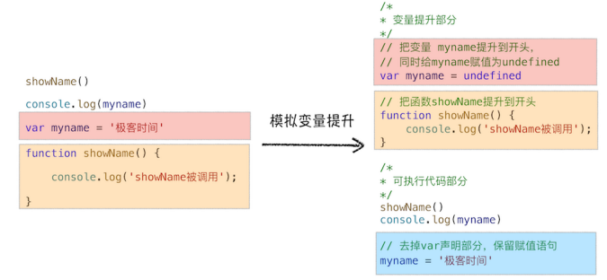

### JS代码的执行流程

**编译阶段**

- 具有**编译阶段**和**执行阶段**
- 一段代码，经过**编译后**生成 **执行上下文** 和 **可执行代码**
- 执行上下文是 JavaScript 执行一段代码时的**运行环境**
  - **变量环境对象 Viriable Environment**——保存变量提升的内容
  - 变量和函数会被存放到**变量环境**中，变量的默认值会被设置为`undefined`
  - 编译阶段，存在两个相同的函数或变量，将会发生覆盖
- JS引擎将声明以外的编译为**字节码**

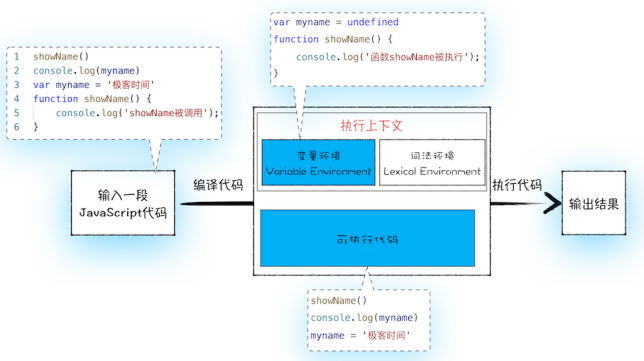

**执行阶段**

-  JS引擎从变量环境中去查找自定义的变量和函数


## 调用栈

- 执行全局代码：编译全局代码并创建**全局执行上下文**，生存周期内唯一
- 调用函数时：
  - 编译函数内代码并创建**函数执行上下文**
  - 一般情况，函数执行结束，函数执行上下文销毁
- 使用 eval 时：编译 eval 的代码并创建执行上下文


**JS的调用栈**

- 调用栈是用来**管理函数调用关系**的一种数据结构
- 创建执行上下文后，JS引擎将执行上下文压入栈中

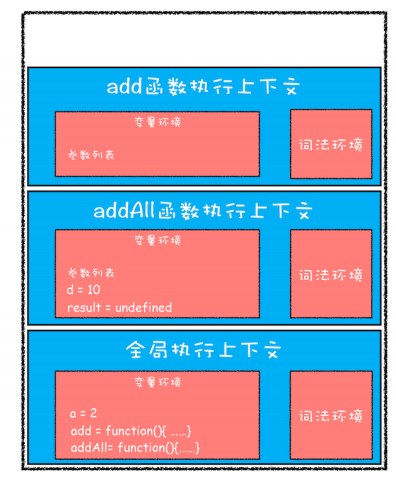

- **栈溢出（Stack Overflow）**——当入栈的执行上下文超过一定数目
- 每调用一个函数，JS 引擎会为其创建执行上下文，并把该执行上下文压入调用栈，然后开始执行函数代码


## 块级作用域

**作用域（scope）**

- 作用域是指在程序中定义变量的区域
- **作用域着变量和函数的可见性和生命周期**

**变量提升的问题**

- 变量容易在不被察觉的情况下被覆盖掉
- **本应销毁的变量没有被销毁**


**支持块级作用域**

- 在编译阶段，函数内部 var 声明的变量，存放到**变量环境**中

- 函数内部 var 声明的变量，存放到**词法环境（Lexical Environment）**中

- 当进入函数的作用域块时，作用域块中 let 声明的变量**存放在词法环境的单独区域**

  - 该区域不影响作用域块外部变量
  - 词法作用域维护小型栈结构，保存 let 和 const 声明变量
  - 使用let/const声明的变量，伴随着词法环境被创建

  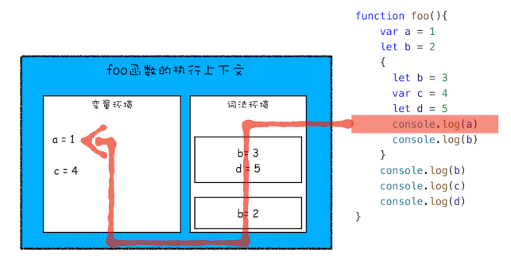


- **块级作用域就是通过词法环境的栈结构来实现的**
- **变量提升是通过变量环境来实现**


## 作用域链和闭包

### 作用域链

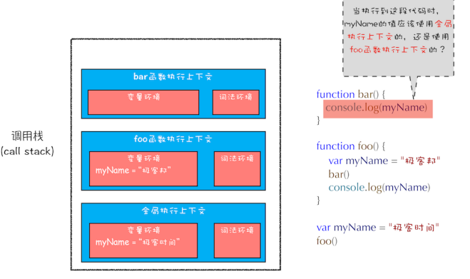

- **每个执行上下文的变量环境都包含一个外部引用（outer），用来指向外部的执行上下文**
- 查找变量时，当前变量环境未查找到将前往outer所指向的执行上下文查找
- 查找的链条叫做作用域链

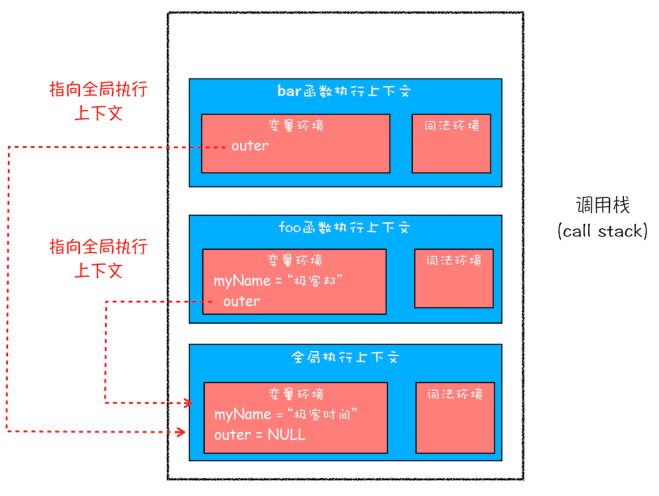

### 词法作用域

- **词法作用域**——指作用域是由代码中函数声明的位置来决定的
- 词法作用域在代码阶段决定的，和函数是如何调用没有关系

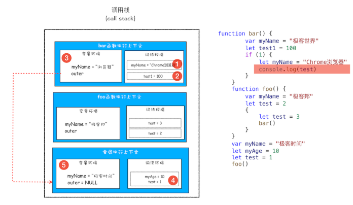

### 闭包

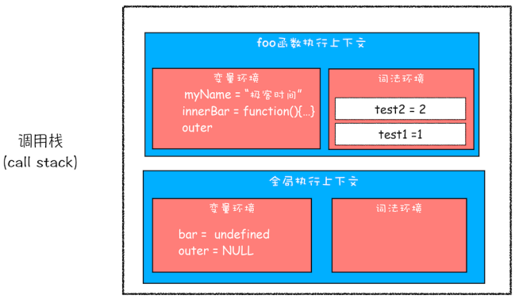

- **词法作用域规则**：**内部函数**总是可以访问它们的外部函数中的变量
- 虽然函数执行上下文销毁，但其**返回对象中的函数仍然保持着对外部函数里变量的引用**，此时创建闭包，将引用的变量保存在内存中
- 在返回函数外，闭包都无法访问

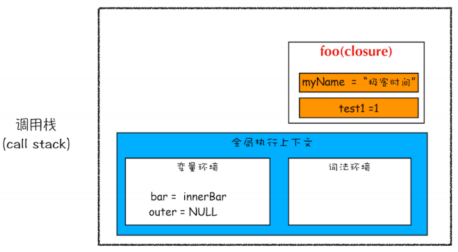

```js
function foo() {
    var myName = "yyyy"
    let test1 = 1
    const test2 = 2
    var innerBar = {
        getName:function(){
            console.log(test1)
            return myName
        },
        setName:function(newName){
            myName = newName
        }
	}
	return innerBar
}
var bar = foo()
bar.setName("xxxx")
bar.getName()
console.log(bar.getName())
```

- **闭包**——**根据词法作用域的规则，内部函数总是可以访问其外部函数中声明的变量，当通过调用一个外部函数返回一个内部函数后，即使该外部函数已经执行结束，但是内部函数引用外部函数的变量依然保存在内存中，将这些变量的集合称为闭包**

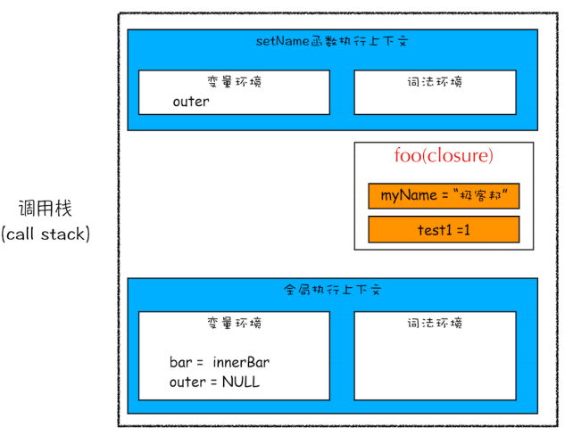

- **闭包回收**——引用闭包的函数是局部变量时，等函数销毁后，在下次执行垃圾回收时，将销毁该块内存


**小结**

- 通过作用域查找变量的链条称为作用域链；作用域链是通过词法作用域来确定的，而词法作用域反映代码的结构


## this

- this 与执行上下文绑定的

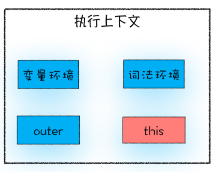

**全局执行上下文中的this**

- 在浏览器，全局执行上下文中的 this 是指向window 对象的

**函数执行上下文中 this**

- 函数作为对象的方法调用时，函数中的 this 就是该对象
- 函数被正常调用时
  - 在严格模式下，this 值是 undefined
  - 非严格模式下 this 指向的是全局对象 window

**this 的设计缺陷**

-  嵌套函数中的 this 不会从外层函数中继承
  - 箭头函数并不会创建其自身的执行上下文，所以箭头函数中的 this 取决于它的外部函数

- 普通函数中的 this 默认指向全局对象 window